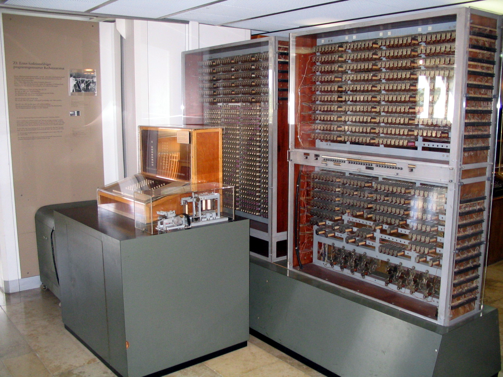
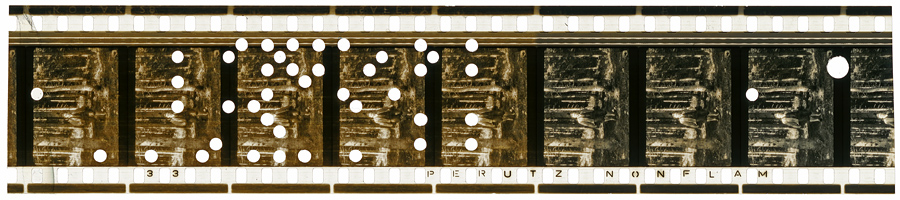
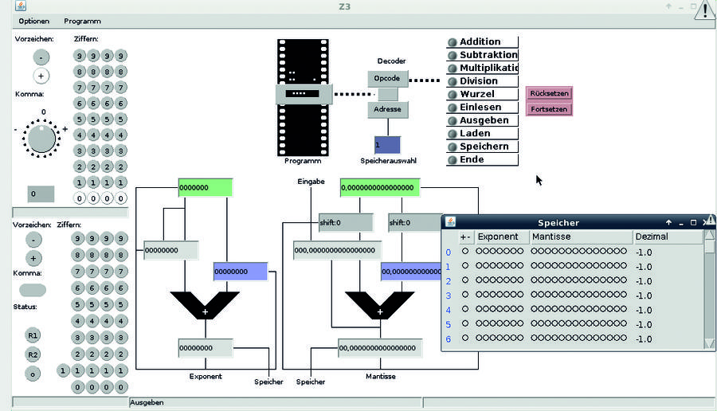
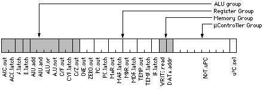
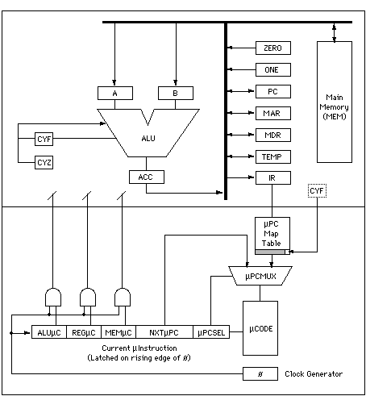
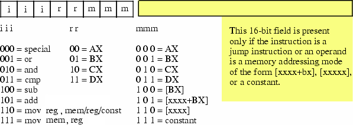
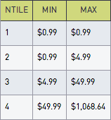

# Software and Programming Language Theory
## Introduction
### History of programming languages
### Classification of programming languages

<style>
.twocolumn {
  -moz-column-count: 2;
  -webkit-column-count: 2;
}
.flex {
  display:flex;
  align-items:center;
  justify-content: center;
}

.flex-column {
  display: flex;
  justify-content: center;
}

.slider section .fullwidth img {
  min-width: 90%;
  width: 90%;
  object-fit: cover;
  /* position: relative; */
}

</style>

Instructor — Maxim A. Krivchikov, senior researcher,
Lomonosov Moscow State University

maxim.krivchikov@gmail.com

https://maxxk.github.io/programming-languages/


# Quick recap
## [Previous semester](https://maxxk.github.io/formal-models/) — Formal models of computation
- the mathematical point of view to the problem of software verification
- evolution of the idea of type in the foundations of mathematics

## Present semester — Formal models of programming languages
- what is the current state of the art in programming languages
- how to describe actual programming languages in mathematical terms
- is the convergence between “mathematical” and “software engineering” approaches possible

# How many programming languages you have acquaintance with?
(to have acquaintance with programming language ≈ can write something more sophisticated than Hello World in less than an hour)


# GitHub can detect 431 programming languages

In 2019 it was 316, in 2018 — 299, in 2017 — 277!

This figure is the lower bound of the count of programming languages which are used by more than one person.

Source: https://github.com/github/linguist/tree/master/vendor/grammars


# Programming language

> A system of precisely defined symbols and rules devised for writing computer programs.
> — <cite>Oxford Dictionary</cite>

> An artificial language used to write instructions that can be translated into machine language and then executed by a computer.
> — <cite>The American Heritage Dictionary of the English language</cite>


# History of programming languages

Sources for the further research:

1. C. Petzold. Code: The Hidden Language of Computer Hardware and Software. Microsoft Press, 2000.
1. В.А. Васенин, М.А. Кривчиков. Формальные модели программ и языков программирования. Часть 1. Библиографический обзор 1930—1989 гг.
2. http://cdn.oreillystatic.com/news/graphics/prog_lang_poster.pdf
3. https://en.wikipedia.org/wiki/Timeline_of_programming_languages
4. Historic machine emulators http://www.historicsimulations.com/ZuseZ3.html

# Generation-based history and classification {.flex}

# Zuse Z3

<span style="font-size: 0.5em">Image source: [Wikimedia Foundation](https://commons.wikimedia.org/wiki/File:Z3_Deutsches_Museum.JPG)</span>


# Zuse Z3 (1941)
<div class="fullwidth">

</div>
<span style="font-size: 0.5em">Image source: [Deutsches Museum](http://www.deutsches-museum.de/en/exhibitions/communication/computers/universal-computers/)</span>


# Zuse Z3
<div class="fullwidth" style="max-height: 60%; height: 60%; max-width: 55%">

</div>
<span style="font-size:small">Image source: https://www.linuxvoice.com/konrad-zuse-nearly-the-german-turing-5/</span>


Some of the early machines (not Zuse Z3) were programmed by rewiring. These machines are not actually automatic programmable computers.

# Machine code
Binary representation of elementary instructions which can be executed directly on CPU.

## 1GL (first-generation programming languages)
See also: Bootstrapping a simple compiler from nothing - 1GL to 3GL

http://homepage.ntlworld.com/edmund.grimley-evans/bcompiler.html

https://github.com/smtlaissezfaire/bcompiler

http://visual6502.org

```x86asm
# _start:
  e8 25 00 00 00    # call  gethex
  c1 e0 04          # sall  $4,%eax
  50                # push  %eax
  e8 1c 00 00 00    # call  gethex
  01 04 24          # add  %eax,(%esp)
  e8 03 00 00 00    # call  putchar
  58                # pop  %eax
  eb e7             # jmp  _start

# +25
# putchar:
  31 db           # xor  %ebx,%ebx
  43              # inc  %ebx
  8d 4c 24 04     # lea  4(%esp),%ecx
  89 da           # mov  %ebx,%edx
  b8 04 00 00 00  # mov  $4,%eax
  cd 80           # int  $0x80
  c3              # ret
```

# Simple CPU
<div style="height:80%;">

</div>
<span style="font-size: 0.5em">Source: C.Petzold. Code</span>

# Microcode
Modern CPUs are not hardwired. The connections between logic units at the opcode execution time are maintained by the microcode — sequence of bit packages describing the signals at each clock.
<div class="twocolumn">

  <div class="fullwidth">
  
  </div>
  <div style="font-size: 0.5em">
  Source: http://www.cs.indiana.edu/~jwmills/EDUCATION.NOTEBOOK/b443/b443.gemini.html
  See also:
  http://www.bedroomlan.org/projects/mcasm
  http://williams.comp.ncat.edu/COMP375/Microcode.pdf
  http://minnie.tuhs.org/CompArch/Tutes/week04.html
  </div>
  <div class="fullwidth" style="max-width: 80%">
  
  </div>
</div>

# 2GL (second-generation programming languages)
Opcode (mnemonic): `add`, `sub`, `jmp`, `je`, `and`, `mov`

Operand: register, constant value, flag, memory, label

Label: get offset at the specified point

<div style="-webkit-column-count: 2; -moz-column-count: 2">
```x86asm
global  strlen
  ; int strlen(const char *string);
strlen:
  push  edi
  sub  ecx, ecx
  mov  edi, [esp+8]
  not  ecx
  sub  al, al
  cld
repne  scasb
  not  ecx
  pop  edi
  lea  eax, [ecx-1]
  ret
```

```x86asm
zstr_count:
  mov ecx, -1

.loop:
  inc ecx
  cmp byte [eax+ecx], 0
  jne .loop

.done:
  ret
```
</div>

# Assembly languages
Assembly instructions are converted into the machine code. 

<span style="font-size: 0.5em:">http://www.c-jump.com/CIS77/CPU/IsaDesign/lecture.html</span>

Simplifed x86-like instruction encoding

<div class="fullwidth">

</div>


# Macroassembler 

## "2.5 generation" language
Macroassemblers allow macros: special directives with parameters which can be substituted at the assembly time.
<div class="twocolumn">
```x86asm
ForLp           macro   LCV, Start, Stop
ifndef  $$For&LCV&      
$$For&LCV&      =       0
else
$$For&LCV&      =       $$For&LCV& + 1
endif

mov     ax, Start
mov     LCV, ax

MakeLbl $$For&LCV&, %$$For&LCV&

mov     ax, LCV
cmp     ax, Stop
jgDone  $$Next&LCV&, %$$For&LCV&
endm

Next            macro   LCV
inc     LCV
jmpLoop $$For&LCV&, %$$For&LCV&
MakeLbl $$Next&LCV&, %$$For&LCV&
endm
```

```x86asm
ForLp   I, 0, 15
ForLp   J, 0, 6

ldax    A, I, J         ;Fetch A[I][J]
mov     bx, 15          ;Compute 16-I.
sub     bx, I
ldax    b, bx, J, imul  ;Multiply in B[15-I][J].
stax    x, J, I         ;Store to X[J][I]

Next    J
Next    I
```
</div>

# High-level programming languages
## 3GL (third-generation programming languages)
Third-generation programming languages feature machine-independence, complex data and code constructions.
```c
typedef struct timespec {
    time_t   tv_sec;        /* seconds */
    long     tv_nsec;       /* nanoseconds */
};

int main(int argc, char **argv) {
    int clk_id = CLOCK_REALTIME;
    const uint TIME_FMT = strlen("2012-12-31 12:59:59.123456789") + 1;
    char timestr[TIME_FMT];

    struct timespec ts, res;
    for (int i = 0; i < 100; i++) {
      clock_getres(clk_id, &res);
      clock_gettime(clk_id, &ts);
    }

    if (timespec2str(timestr, TIME_FMT, &ts) != 0) {
        printf("timespec2str failed!\n");
        return EXIT_FAILURE;
    } else {
        unsigned long resol = res.tv_sec * NANO + res.tv_nsec;
        printf("CLOCK_REALTIME: res=%ld ns, time=%s\n", resol, timestr);
        return EXIT_SUCCESS;
    }
}
```

# 4GL: Data querying and manipulation languages
Fourth-generation languages are declarative, mostly concerned with data manipulation.
<div class="twocolumn">
```sql
select  quartile,  
  min(spend) as min,  
  max(spend) as max
from (
  select  spend,  ntile(4)
    over (order by spend asc)
    quartile
  from (
    select user_id,
      sum(price) as spend
    from purchases
    group by 1
  ) user_spend
) user_spend_quartiles
group by 1
order by ntile asc
```

<div class="small">Source: https://www.periscopedata.com/blog/window-functions-by-example.html</div>
</div>
SQL (without cursors and imperative extensions) is probably the only successful general fourth generation language.

# 4GL: Data querying and manipulation languages
Also include: report and form-generation languages (ABAP, dBase, FoxPro), wide range of domain specific declarative languages (Wolfram Language, AMPL, MATLAB).

Some features of modern high-level programming languages take roots in 4GL (e.g. list comprehensions).

Some disadvantages of 4GL:

- syntax is very verbose, unneccessarily mimics natural languge
- complicated debugging
- unpredictable performance (programs in 4GL are, usually, orders of magnutude slower than high-performance optimized implementation in general-purpose programming language)
- complicated development process, compatibility problems

# 5GL: Logical inference and constraint-based
Fifth-generation languages were the ultimate dream of software engineers in 1980s :)

Example: Prolog, Datalog

Programmer specifies the model and formulates the task. The runtime solves the specified constraints using some knowledge-inference engines (first-order inferene, frame inference).

You can try Prolog here: http://swish.swi-prolog.org/example/houses_puzzle.pl

# Einstein riddle (who keeps zebra?) in Prolog
```prolog
neigh(Left, Right, List) :-
        List = [Left | [Right | _]];
        List = [_ | [Left | Right]].

zebraowner(Houses, ZebraOwner):-
        member([englishman, _, red], Houses),
        member([spanish, jaguar, _], Houses),
        neigh([_, snail, _], [japanese, _, _], Houses),
        neigh([_, snail, _], [_, _, blue], Houses),
        member([ZebraOwner, zebra, _], Houses),
        member([_, _, green], Houses).


zebra(X) :- zebraowner([_, _, _], X).
```

```
zebra(Owner).
> Owner = japanese
```

# II. Influential programming languages

## First widespread programming languages
Fortran, Cobol, Algol, Lisp

## Languages which introduced some important concepts
ML, Prolog, Smalltalk, Forth, APL, Refal, Haskell


# FORTRAN: the first widely-used high-level language
FORmula TRANslator. John Backus, IBM, 1954-57
```fortran
C AREA OF A TRIANGLE - HERON'S FORMULA
C INPUT - CARD READER UNIT 5, INTEGER INPUT
C OUTPUT - LINE PRINTER UNIT 6, REAL OUTPUT
C INPUT ERROR DISPLAY ERROR OUTPUT CODE 1 IN JOB CONTROL LISTING
      INTEGER A,B,C
      READ(5,501) A,B,C
  501 FORMAT(3I5)
      IF(A.EQ.0 .OR. B.EQ.0 .OR. C.EQ.0) STOP 1
      S = (A + B + C) / 2.0
      AREA = SQRT( S * (S - A) * (S - B) * (S - C) )
      WRITE(6,601) A,B,C,AREA
  601 FORMAT(4H A= ,I5,5H  B= ,I5,5H  C= ,I5,8H  AREA= ,F10.2,12HSQUARE UNITS)
      STOP
      END
```

# Fortran is alive
Fortran 2018 was released on November 28, 2018. It specifies interoperability with C programming language and parallel computing intrinsics.

http://www.fortran.bcs.org/2012/nm_talk.pdf

```fortran
do i = this_image(), limit, num_images()
    pi = pi + (-1)**(i+1) / real( 2*i-1, kind=rk )
end do
    sync all ! global barrier
if (img .eq. 1) then
    do i = 2, nimgs
        pi = pi + pi[i]
    end do
    pi = pi * 4.0_rk
end if
```

Equivalent to MPI code:
```fortran
do i = rank+1, limit, nprocs
    pi = pi + (-1)**(i+1) / real( 2*i-1, kind=rk )
end do
call MPI_REDUCE( pi, picalc, 1, MPI_DOUBLE_PRECISION, &
    MPI_SUM, 0, MPI_COMM_WORLD, ierr )
picalc = picalc * 4.0_rk
```

# COBOL: COmmon Business-Oriented Language
Grace M. Hopper, CODASYL consortium, 1959.

One of the first languages initially designed without any academic (computer science) influence.

Nowadays, as I have probably already mentioned in an introduction of the previous course, COBOL programs represent the canonical example of legacy code: more than a half of an enterprises (in US) use several billions lines of COBOL code in their everyday activity. The migration cost is very high, so in short future COBOL share won't drop significantly.

# COBOL: 4GL prototype
<div class="smaller">
```cobol
RD  sales-report
         PAGE LIMITS 60 LINES
         FIRST DETAIL 3
         CONTROLS seller-name.

     01  TYPE PAGE HEADING.
         03  COL 1                    VALUE "Sales Report".
         03  COL 74                   VALUE "Page".
         03  COL 79                   PIC Z9 SOURCE PAGE-COUNTER.

     01  sales-on-day TYPE DETAIL, LINE + 1.
         03  COL 3                    VALUE "Sales on".
         03  COL 12                   PIC 99/99/9999 SOURCE sales-date.
         03  COL 21                   VALUE "were".
         03  COL 26                   PIC $$$$9.99 SOURCE sales-amount.

     01  invalid-sales TYPE DETAIL, LINE + 1.
         03  COL 3                    VALUE "INVALID RECORD:".
         03  COL 19                   PIC X(34) SOURCE sales-record.

     01  TYPE CONTROL HEADING seller-name, LINE + 2.
         03  COL 1                    VALUE "Seller:".
         03  COL 9                    PIC X(30) SOURCE seller-name.
```
```cobol
OPEN INPUT sales, OUTPUT report-out
          INITIATE sales-report

          PERFORM UNTIL 1 <> 1
              READ sales
                  AT END
                      EXIT PERFORM
              END-READ

              VALIDATE sales-record
              IF valid-record
                  GENERATE sales-on-day
              ELSE
                  GENERATE invalid-sales
              END-IF
          END-PERFORM

          TERMINATE sales-report
          CLOSE sales, report-out
          .
```
</div>

# ABAP (contemporary COBOL successor, SAP ERP)
SAP SE, ~1981-83.
```abap
REPORT ZSOURCE2307.
* List of the current program
WRITE / 'I am program ZSOURCE2307'.
* External perform
PERFORM EXTFORM IN PROGRAM ZSOURCE2308.

Program 2
REPORT ZSOURCE2308.
* Form definition
FORM EXTFORM.
if sy-cprog <> 'ZSOURCE2307'.
  WRITE / 'I am extform in program ZSOURCE2308.'.
endif.
ENDFORM.
```

# ALGOL
ALGOrithmic Language, first implementation in 1958 (known as International Algebraic Language, IAL).

Developed by joint committee of American and Soviet computer scientists, after standartization was immediately adopted as GOST standart in USSR. John Backus (one of FORTRAN creators), John McCarthy (creator of LISP), Peter Naur (creator of BNF grammar specification formalism), Edsger Dijkstra (no need to introduce :) took part in the original development. Algol 60 and Algol 68 followed.

Code examples in the following slides are in Algol 68, which is different from the most widespread Algol 60.

# ALGOL
```algol
proc abs max = ([,]real a, ref real y, ref int i, k)real:
comment The absolute greatest element of the matrix a, of size ⌈a by 2⌈a
is transferred to y, and the subscripts of this element to i and k; comment
begin
   real y := 0; i := ⌊a; k := 2⌊a;
   for p from ⌊a to ⌈a do
     for q from 2⌊a to 2⌈a do
       if abs a[p, q] > y then
           y := abs a[p, q];
           i := p; k := q
       fi
     od
   od;
   y
end # abs max #
```

# ALGOL
<div class="smaller">
```algol
ref vector row = m[2,];  # define a ref (pointer) to the 2nd row #
ref vector col = m[,2];  # define a ref (pointer) to the 2nd column #

mode node = union (real, int, compl, string),
     list = struct (node val, ref list next);
node n := "1234";

# tagged unions #
case n in
   (real r):   print(("real:", r)),
   (int i):    print(("int:", i)),
   (compl c):  print(("compl:", c)),
   (string s): print(("string:", s))
   out         print(("?:", n))
esac
```

```algol
prio max = 9;
# Custom operators with overloading! #
op max = (int a,b) int: ( a>b | a | b );
op max = (real a,b) real: ( a>b | a | b );
op max = (compl a,b) compl: ( abs a > abs b | a | b );

op max = ([]real a) real:
   (real out := a[lwb a];
    for i from lwb a + 1 to upb a do ( a[i]>out | out:=a[i] ) od;
    out)
```
</div>

# LISP
## dynamic typing, functional programming, macros
Introduced by John McCarthy in 1958, based on lambda-calculus. One of the most popular languages for AI development in time span from 1960s to the end of 1980s.

Today there are 3 widespread dialects:

- Scheme (minimal and extensible, see also ["Lambda: the ultimate ..." papers](http://library.readscheme.org/page1.html))
- Common LISP (large system with rich standard library)
- Clojure (LISP dialect for Java ecosystem)

See also: http://www.flownet.com/gat/papers/lisp-java.pdf

# LISP
```sbcl
(defun get-from-list(list pred)
  (let ((ans (first list)))
    (do ((i 1 (1+ i)))
        ((>= i (length list)) ans)
      (when (funcall pred (nth i list) ans)
        (setf ans (nth i list))))))

 (defun get-max(list)
   (get-from-list list #'>))

 (defun get-min(list)
   (get-from-list list #'<))
```

Macros make possible to define "lazy" and "short-circuiting" operators.

```
(defmacro multi-run (times &body algo-call)
   `(loop for ,(gensym) below ,times collect (progn ,@algo-call)))

(multi-run 50 (solve-prob test-case (make-instance 'tabu-search)))
```

# Smalltalk: object-oriented programming
Alan Kay et al., Xerox PARC, 1972

Message-based, prototype-based object-oriented programming
```smalltalk
| rectangles aPoint collisions |
rectangles := OrderedCollection
  with: (Rectangle left: 0 right: 10 top: 100 bottom: 200)
  with: (Rectangle left: 10 right: 10 top: 110 bottom: 210).
aPoint := Point x: 20 y: 20.
collisions := rectangles select: [:aRect | aRect containsPoint: aPoint].
```

# Prolog: logical (constraint-based) programming
Alain Colmerauer, 1972.
(already mentioned at 5GL section)

# Forth: stack-based programming
Charles H. Moore, 1970.
https://skilldrick.github.io/easyforth/#snake
```forth
: move-up  -1 snake-y-head +! ;
: move-left  -1 snake-x-head +! ;
: move-down  1 snake-y-head +! ;
: move-right  1 snake-x-head +! ;

: move-snake-head  direction @
  left over  = if move-left else
  up over    = if move-up else
  right over = if move-right else
  down over  = if move-down
  then then then then drop ;

\ Move each segment of the snake forward by one
: move-snake-tail  0 length @ do
    i snake-x @ i 1 + snake-x !
    i snake-y @ i 1 + snake-y !
  -1 +loop ;
```

# APL: array programming
Kenneth Iverson, IBM, 1964.
Array Programming Languages syntax uses special graphical symbols to define array operations.
Example program (Game of Life simulator):

> life←{↑1 ⍵∨.∧3 4=+/,¯1 0 1∘.⊖¯1 0 1∘.⌽⊂⍵}

Check whether an integer is a power of 2 without using +,- operations

> 0=1|2⍟⎕

i.e. 0 = mod(log(input(),2),1)

Unicode standard has some APL-specific symbols.

Advantage: extremely concise (short) programs. Its ASCII-successor J is very popular in "coding golf" competitions.

Disadvantage: unreadable programs.

http://tryapl.org/

# APL example
Prime numbers example (from Wikipedia):
> (~R∊R∘.×R)/R←1↓ιR

Executed from right to left, this means:

- ιR (Iota) = integers from 1 to R (if R = 6, ιR is 1 2 3 4 5 6)
- Drop first element of this vector (↓ function), i.e. 1. So 1↓ιR is 2 3 4 5 6
- Set R to the new vector (←, assignment primitive), i.e. 2 3 4 5 6
- The / compress function is dyadic (binary) and the interpreter first evaluates its left argument (entirely in parentheses):
    * Generate outer product of R multiplied by R (°.× operator)
    * Build a vector the same length as R with 1 in each place where the corresponding number in R is in the outer product matrix (∈, set inclusion or element of or Epsilon operator), i.e. 0 0 1 0 1
    * Logically negate (not) values in the vector (change zeros to ones and ones to zeros) (∼, logical not or Tilde operator), i.e. 1 1 0 1 0
- Select the items in R for which the corresponding element is 1 (/ compress operator), i.e. 2 3 5

# Refal (REcursive Functions ALGOrithmic Language)

Created in Soviet Union in 1968 by Valentin F. Turchin.

Recursive term rewriting language, based on Markov Algorithms.
Original concept of Refal was the metalanguage for programming language syntax and semantics.
Features advanced pattern-matching.

Example: Palindrome

```
 Pal { = True;
    s.1 = True;
    s.1 e.2 s.1 = <Pal e.2>;
    e.1 = False;  }
```

Implementations:

1. CMC MSU Refal-2 https://github.com/cmc-msu-ai/refal
2. BMSTU Refal → C compiler
  - https://github.com/rfatkullin/bmstu-refal-compiler
  - https://github.com/rfatkullin/bmstu-refal-runtime
  


# Refal Example: untyped lambda-calculus interpreter

<div class="twocolumn">

```
Wait = <Card> = ;

Subst { 
    s.var t.value s.var e.rest s.x1 
      = t.value <Subst s.var t.value e.rest> ;
    s.var t.value (λ s.var e.body) e.rest 
      = (λ s.var e.body) <Subst s.var t.value e.rest> ;
    s.var t.value (e.inside) e.rest 
      = (<Subst s.var t.value e.inside>) 
        <Subst s.var t.value e.rest> ;
    s.var t.value s.other e.rest 
      = s.other <Subst s.var t.value e.rest> ;
    s.var t.value = ;
}

Beta {
    (( e.double )) e.rest = Step (e.double) e.rest ;
    (λ s.var '.'  e.body) t.value e.rest =
        Step <Subst s.var t.value e.body> e.rest ;
    (λ s.var '.'  e.body) =
        <Beta e.body> : s.state e.result = 
        s.state (λ s.var '.' e.result) ;
    (e.1) e.rest =
        <Beta e.1> => {
            Step e.result = Step (e.result) e.rest ;
            Stuck e.result = <Beta e.rest> 
              : s.state e.result2 =
                s.state (e.result) e.result2 ;
        } ;
    t.neutral e.rest =
        <Beta e.rest> : s.state e.result =
        s.state t.neutral e.result ;
    = Stuck;
}

Loop {
    e.val = 
        <Beta e.val> : s.state e.res =
        <Print s.state> <Print <PPrint ('    ') e.res>> =
        s.state => {
            Step = <Loop <Wait> e.res> ;
            Stuck = <Print DONE> ;
        } 
}

Omega = (λ x '.' x x) (λ y '.' y y) ;
Y = (λ yF '.' (λ yX '.' yF (yX yX)) (λ yX '.' yF (yX yX))) ;
Comp = (λ f '.' (λ g '.' (λ x '.' (g (f x)))));

$ENTRY Go {
 =   <Print <PPrint () <Y> <Fact> 3>>
  <Loop <Y> <Fact> 3> ;
}
```

</div>


# Homework assignments
**Task 1.1** (at most 6* in total, at most one language from category, you can use modern implementations/dialects)

Implement something non-trivial (more than 200 lines in equivalent C code) in languages from list:

<div class="twocolumn">

- Forth **
- APL, J **
- Refal **
- Idris, Agda, Coq **
- Prolog **
- Scheme, Racket, Clojure, Common LISP or Emacs LISP **
- Haskell *
- Smalltalk *
- Fortran *
- Algol *
- Ada *
- Assembly (x86-64 or ARM) *
</div>

<!--
# Project
Alternatively you can write a specification of a toy programming language. In total you will get at least 10 stars.
Choose a single application area and try to imagine a simple programming language which is more convenient to use in that area than, for example, C.

**Project Step 1.\*** Write a "design document" (short informal description, 1-4 pages, in English) of a toy programming language of your choice. Design document must include the following information:
- what is the main focus of the language
- examples of language statements and results of evaluation for such statements

Language must support variables or named function arguments.

# Sample project ideas
- html templating engine
- diagram drawing
- document markup
- arithmetical expressions with units of measurement
- linear algebra
- asynchronous control
- shared-memory concurrency
- distributed-memory concurrency
-->
