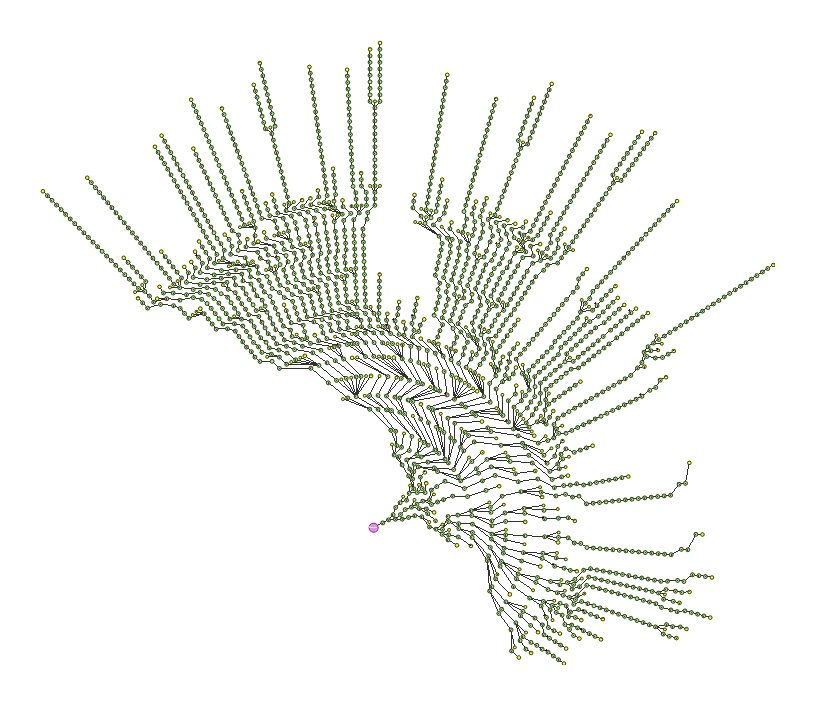

# Software and Programming Language Theory

## Notation and proof assistants
## Formal syntax analysis
## Macros as a part of syntax

<style>
.twocolumn {
  -moz-column-count: 2;
  -webkit-column-count: 2;
  column-count: 2;
}
.small { font-size: small !important; }
.smaller { font-size: 0.8em !important; }
.large { font-size: 1.5em !important; }
.huge { font-size: 2em !important; }
</style>

https://maxxk.github.io/programming-languages/

maxim.krivchikov@gmail.com

# Programming language specification
```{.graphviz .dot}
digraph Spec {
  edge [minlen=3.0];

  { rank=same; Syntax, Semantics, Pragmatics };
  Specification -> Syntax;
  Specification -> Semantics;
  Specification -> Pragmatics;
  Syntax -> Grammar [label="Specification"];
  Syntax -> "Parse Tree" [label="Proof"];
  Syntax -> AST [label="Corollary"];  
}
```
# BNF formally
BNF has a graph structure (actually, a directed hypergraph with per-edge ordered destination nodes). Parse tree is a tree derived from the graph (if syntax analysis walks through a cycle, first repeating vertex is duplicated).
```{.graphviz .dot}
digraph Syntax {
  { rank=same; term, factor, atom };
  term -> factor;
  term -> seq_term;
  seq_term -> term [label="1"];
  seq_term -> "'+'" [label="2"];
  seq_term -> factor [label="3"];

  factor -> atom;
  factor -> seq_factor;
  seq_factor -> factor [label="1"];
  seq_factor -> "'*'" [label="2"];
  seq_factor -> atom [label="3"];

  atom -> number;
  atom -> seq_atom;
  seq_atom -> "(" [label="1"];
  seq_atom -> term [label="2"];
  seq_atom ->  ")" [label="3"];
}
```

<div class="smallish">
```c
term ::= factor | term '+' factor
factor ::= atom | factor '*' atom
atom ::= number | '(' term ')'
```
```c
(3+2)*4+1
```
</div>

# Mechanization
<div class="smaller">
Programs are complex. Theoretically, you can make a mathematical description of a programming language on paper with some assumptions. But usually proving properties on paper is infeasible. Therefore we have to use some (mathematically sound) mechanization tools to make a precise reasoning about  the program. Scientific publications which we will discuss today use Coq or Agda proof-assistants for mechanization.
</div>

<div class="twocolumn" style="font-size: 0.5em;">
```c++
class HashEntry
{
private:

      int key;
      int value;

public:

      HashEntry(int key, int value)
      {
            this->key = key;
            this->value = value;
      }

      int getKey() { return key; }

      int getValue() { return value; }
};

const int TABLE_SIZE = 128;

class HashMap
{
private:

      HashEntry **table;

public:

      HashMap()
      {
            table = new HashEntry*[TABLE_SIZE];

            for (int i = 0; i < TABLE_SIZE; i++)
                  table[i] = NULL;
      }

      int get(int key)
      {
            int hash = (key % TABLE_SIZE);

            while (table[hash] != NULL && table[hash]->getKey() != key)
                  hash = (hash + 1) % TABLE_SIZE;

            if (table[hash] == NULL)
                  return -1;
            else
                  return table[hash]->getValue();
      }

      void put(int key, int value)
      {
            int hash = (key % TABLE_SIZE);

            while (table[hash] != NULL && table[hash]->getKey() != key)
                  hash = (hash + 1) % TABLE_SIZE;

            if (table[hash] != NULL)
                  delete table[hash];

            table[hash] = new HashEntry(key, value);
      }     

      ~HashMap()
      {
            for (int i = 0; i < TABLE_SIZE; i++)
                  if (table[i] != NULL)
                        delete table[i];

            delete[] table;
      }
};
```

2009 nodes in an abstract syntax tree.

</div>
<div class="small">Example from: http://stackoverflow.com/a/11025084</div>

# Notation
A → B
~ function from type A to type B

(a : A) → B(a) 
~ dependent function (dependent product) mapping an element *a* of type A to representative B(a) of family: \
B : A → Type

A + B 
~ sum type (either an element of A or element of B)
inl : A → A + B
inr : B → A + B 

A × B 
~ product type (ordered pair of elements from A and B)
(a, b) : A × B

(a : A) × B(a) 
~ dependent sum, an ordered pair of element *a* from A and element from representative B(a) of 
family B : A → Type


# Inductive types
```
term ::= factor | term '+' factor
factor ::= atom | factor '*' atom
atom ::= number | '(' term ')'
```

Abstract syntax tree for the grammar is defined by three mutually inductive types:

```
Term   = TFactor (f : Factor) | TSum (t : Term) (f : Factor)
Factor = FAtom (a : Atom)     | FProduct (f : Factor) (a : Atom)
Atom   = ANumber (n : Number) | AGroup (t : Term)
```

# Pattern matching

An interpreter for an abstract syntax tree from previous slide is defined with pattern matching (case analysis) over the inductive type constructors:

```
interpretTerm : Term → Number
interpretTerm (TFactor f) = interpretFactor f
interpretTerm (TSum t f) = (interpretTerm t) + (interpretFactor f)
interpretFactor : Factor → Number
interpretFactor (FAtom a) = interpretAtom a
interpretFactor (FProduct f a) = (interpretFactor f) * (interpretAtom a)
interpretAtom : Atom → Number
interpretAtom (ANumber n) = n
interpretAtom (AGroup t) = interpretTerm t
```

# Proof assistants: Coq and Agda
Coq and Agda are the proof assistants based on dependently-typed lambda calculus ([remember the previous semester](https://maxxk.github.io/formal-models/)).

## Coq
ML-like syntax.

Homepage: https://coq.inria.fr

Textbook: http://adam.chlipala.net/cpdt/

Quickstart (in Russian): https://habrahabr.ru/post/182442/

Another short texbook (in Russian): http://lpcs.math.msu.su/~krupski/download/coq_pract.pdf

## Agda
Haskell-like syntax.

Homepage: http://wiki.portal.chalmers.se/agda/pmwiki.php?n=Main.HomePage

Introduction paper: http://www.cse.chalmers.se/~ulfn/papers/afp08/tutorial.pdf

Example (in Russian): https://habrahabr.ru/post/148769/

# Coq and Agda
In Coq and Agda all definable functions are (under the normal circumstances) total, which means:

1. The function must accept any input of the specified type, errors like Haskell's "non-exhaustive patterns" are not possible:

```haskell
helper :: Integer -> [Integer] -> [Integer] -> [(Integer,Integer)] -> [Integer]
helper n [] (v) _ = []
helper n (x:y:xs) (v) (c:cs) =
    if (chinese3 (b:c:cs) == n)
      then (x:v)
    else helper n (xs) (x:v) ((n `mod` y,y):c:cs)
    where b =(n `mod` x,x)

-- helper 10 primes [] [] ⟶ error: Non-exhaustive patterns in function helper.
```

2. The function must terminate for any input. Infinite recursion is not allowed:
```haskell
helper a b c d = helper a (a:b) c d
```

# Agda examples
Inductive datatype is defined by a set of constructors. Note that indentation is significant (like in Python and Haskell)
```agda
data Nat : Set where
    zero : Nat
    succ : Nat → Nat
```
Function on inductive types are defined by the means of pattern matching.
```agda
plus : Nat → Nat → Nat
plus zero m = m
plus (succ n) m = succ (plus n m)
```

# Agda examples
Dependent product indexed type familiy. Note that the implicit argument n to `cons` is enclosed in braces.
```agda
data Vec (A : Set) : Nat → Set where
    [] : Vec A zero
    cons : {n : Nat} → A → Vec A n → Vec A (succ n)

cons zero [] -- Vector with a single element (0)

head : {A : Set}{n : Nat} → Vec A (succ n) → A
head (cons x xs) = x
```

# Coq examples
Inductive data types. Indentation is not significant in Coq. Statements are terminated by dot `.`
```coq
Inductive nat : Type :=
 | O : nat
 | S : nat → nat.
```
There are some different keywords for definitions (`Definition`, `Inductive`, `Fixpoint`, `Program Definition`). Functions are defined like in lambda-calculus, pattern matching is possible with `match` expression:
```coq
Fixpoint plus (a b : nat) : nat :=
  match a with
  | O ⇒ b
  | S a' ⇒ S (plus a' b)
  end.
```

# Coq examples
Dependent type family. As in Agda, implicit arguments are written inside braces, explicit dependent arguments are written insied the round brackets.
```coq
Inductive Vector (A : Set) : nat → Set :=
  | Nil : Vector A O
  | Cons : forall {n : Nat}, A → Vector A n → Vector a (S n).
```

```coq
Definition head' A n (vec : Vector A n) :=
  match vec in (Vector A n) return
    (match n with O ⇒ unit | S _ ⇒ A end) with
    | Nil ⇒ tt
    | Cons h _ ⇒ h
  end.

Definition head A n (vec : Vector A (S n)) : A := head' vec.
```

# Coq and Agda example side by side

<div class="twocolumn">

```ocaml
Inductive Nat :=
  | zero : Nat
  | succ : Nat -> Nat.

Inductive Even: Nat -> Prop :=
  | even_base : Even zero
  | even_step : forall n, Even n -> Even (succ (succ n)).

Fixpoint add (n:Nat) (m:Nat) :=
  match n with
    | zero => m
    | succ n' => succ (add n' m)
  end.

Lemma add_succ:
  forall n m, add (succ n) m  = succ (add n m).
Proof.
  auto.
Qed.

Lemma even_sum :
  forall n m, Even n -> Even m -> Even (add n m).
Proof.
  intros n m even_n even_m.
  induction even_n.
   (* case even_base *)
   - simpl.
     assumption.
   (* case even_step *)
   - repeat (rewrite add_succ).
     apply even_step.
     assumption.
Qed.
```

```agda
data Nat : Set where
  zero : Nat
  succ : Nat -> Nat

data Even : Nat -> Set where
  even_base : Even zero
  even_step : forall {n} -> Even n -> Even (succ (succ n))

_+_ : Nat -> Nat -> Nat
zero + n = n
(succ n) + m = succ (n + m)

even_sum : forall {n m} -> Even n -> Even m -> Even (n + m)
even_sum even_base x      = x
even_sum (even_step x) y  = even_step (even_sum x y)
```

<span class="small">
Source: https://dorchard.blog/2015/03/02/an-afternoon-of-dtttheorem-provers-agda-and-coq/
</span>

</div>


# Formal syntax analysis
Parser is a function which implements syntax analysis.

Suppose we have defined a syntax as a grammar G + an abstract syntax tree and implemented a parser P.
More realistic example: you write a code generator, so you have to make sure (to prove)
that it will always generate code without compiling.

P : String → AST + SyntaxError

How can we make sure that our parser will:

1. accept all strings from G-defined language,
2. reject any string outside of G-defined language,
3. terminate for every finite input?

## Why won't we just write a parser in a proof assistant?
From the previous lecture: left recursion.
```
term ::= factor | term '+' factor
factor ::= atom | factor '*' atom
atom ::= number | '(' term ')'
```

```
x+1 ⟶ ⟂
```
(try to parse a `term`, `x` is not a `factor` so it must be a `term` and now we have a cycle)


# Danielsson. Total Parser Combinators (2010)
Main idea is: use the lazy computation. Total, dependently-typed programming languages may represent infinite lazy computations as a corecursive type. After the parsing process is represented as tree with some infinite-depth paths, make a breadth-first search of successful parse result.
```agda
data List (A : Set) : Set where
  [] : List A
  _::_ : A → List A → List A

data Colist (A : Set) : Set where
  [] : Colist A
  _::_ : A → ∞ (Colist A) → Colist A

♯ : {A : Set} →  A → ∞ A
♭ : {A : Set} → ∞ A→ A
```

<span class="smaller">
Danielsson N.A. Total parser combinators // Proceedings of the 15th ACM SIGPLAN international conference on Functional programming - ICFP ’10. ACM Press, 2010. P. 285–285.
Source and paper is available at: http://www.cse.chalmers.se/~nad/publications/danielsson-parser-combinators.html
</span>

# Danielsson. Total Parser Combinators (2010)
```agda
map : ∀{A B} → ( A → B) → Colist A → Colist B
map f [ ] = [ ]
map f (x::xs) = f x :: ♯ map f (♭xs)
```

```agda
mutual
  -- The index is true if the corresponding language contains the
  -- empty string (is nullable).
  data P : Bool → Set where
    fail  : P false
    empty : P true
    tok   : Tok → P false
    _∣_   : ∀ {n₁ n₂} → P n₁ →            P n₂ → P (n₁ ∨ n₂)
    _·_   : ∀ {n₁ n₂} → P n₁ → ∞⟨ not n₁ ⟩P n₂ → P (n₁ ∧ n₂)

  -- Coinductive if the index is true.
  ∞⟨_⟩P : Bool → Bool → Set
  ∞⟨ true  ⟩P n = ∞ (P n)
  ∞⟨ false ⟩P n =    P n
```

# Danielsson. Total Parser Combinators (2010)
Example from: http://www.cse.chalmers.se/~nad/publications/danielsson-parser-combinators/TotalParserCombinators.Examples.Expression.html#233

```agda
module Monadic where
  mutual
    term   = factor
           ∣ ♯ term            >>= λ e₁ →
             tok '+'           >>= λ _  →
             factor            >>= λ e₂ →
             return (e₁ + e₂)
    factor = atom
           ∣ ♯ factor          >>= λ e₁ →
             tok '*'           >>= λ _  →
             atom              >>= λ e₂ →
             return (e₁ * e₂)
    atom   = number
           ∣ tok '('           >>= λ _  →
             ♯ term            >>= λ e  →
             tok ')'           >>= λ _  →
             return e
```

# And what about proofs?
Simplification
```agda
-- f <$> fail                  → fail
-- f <$> return x              → return (f x)
-- fail         ∣ p            → p
-- p            ∣ fail         → p
-- token >>= p₁ ∣ token >>= p₂ → token >>= (λ t → p₁ t ∣ p₂ t)  (*)
-- ...
simplify₁ : ∀ {Tok R xs} (p : Parser Tok R xs) →
            ∃₂ λ xs (p′ : Parser Tok R xs) → p ≅P p′
```
Completeness
```agda
-- A proof showing that all functions of type List Bool → List R can
-- be realised using parser combinators (for any R, assuming that bag
-- equality is used for the lists of results).
parser⇒fun : ∀ {R xs} (p : Parser Bool R xs) {x s} →
             x ∈ p · s ⇿ x ∈ parse p s
maximally-expressive :
 ∀ {R} (f : List Bool → List R) {s} →
 parse (grammar f) s ≈[ bag ] f s
```

# Koprowski, Binsztok. TRX: A Formally Verified Parser Interpreter
Main idea: like in original PEG parsers, disallow direct and indirect left-recursive grammars. [Patented](http://www.google.com/patents/EP2454661A1?cl=en) algorithm.
```coq
Definition wf_analyse (exp : pexp) (wf : PES.t) : bool :=
  match exp with
  | empty ⇒ true
  | range     ⇒ true
  | terminal a ⇒ true
  | anyChar ⇒ true
  | nonTerminal p ⇒ is_wf (production p) wf
  | seq e1 e2 ⇒ is_wf e1 wf ∧ (if e1 − [gp] → 0 then is_wf e2 wf else true) | choice e1 e2 ⇒ is_wf e1 wf ∧ is_wf e2 wf
  | star e ⇒ is_wf e wf ∧ (negb (e − [gp] → 0))
  |note ⇒is_wf e wf
  | id e ⇒ is_wf e wf
end.
```

```coq
Program Fixpoint parse (T : Type) (e : PExp T | is grammar exp e) (s : string)
{measure (e , s ) ≻ } : {r : ParsingResult T | ∃ n , [ e , s ] ⇒ [ n , r ] }
```

<div class="smaller">
Koprowski A., Binsztok H. TRX: A Formally Verified Parser Interpreter // Logical Methods in Computer Science / ed. Gordon A. 2011. Vol. 7, № 2.
[(arXiv)](https://arxiv.org/abs/1105.2576)
[(presentation PDF)](http://www.cs.ru.nl/~Adam.Koprowski/pres/trx-esop-10.pdf)  

Medeiros S., Ierusalimschy R. A parsing machine for PEGs // Proceedings of the 2008 symposium on Dynamic languages - DLS ’08. 2008. P. 1–12.
[(ACM)](https://dl.acm.org/doi/10.1145/1408681.1408683)
[(Citeseer PDF)](http://citeseerx.ist.psu.edu/viewdoc/download?doi=10.1.1.139.1374&rep=rep1&type=pdf)
</div>

# See also
1. Uustalu, Tarmo, Firsov, Denis. Certified Parsing of Regular Languages // Certified Programs and Proofs. Springer International Publishing, 2013. P. 98–113.
2. Jourdan J.-H., Leroy X., Pottier F. Validating LR(1) Parsers // Proceedings of the 21st European Symposium on Programming. 2012. Vol. 7211. P. 397–416.
1. Bernardy, Jean-Philippe, Jansson, Patrik. Certified Context-Free Parsing: a Formalisation of Valiant's Algorithm in Agda: Preprint. Chalmers University of Technology, University of Gothenburg, Sweden, 2016. 27 p.
2. Sjöblom, Thomas Bååth. An Agda proof of the correctness of Valiant’s algorithm for context free parsing: MSc. Göteborg University: Chalmers University of Technilogy, University of Gothenburg, 2013. 63 p.


# Macros and staged computations
Macro (macroinstruction) — is a rule of generation a set of instructions in compile-time.

Different kinds of macros may be related to both syntax and static semantics of programming language.

# Macroassemblers revisited
Macros are substituted before the assembly time.
<div class="twocolumn">
```x86asm
ForLp           macro   LCV, Start, Stop
ifndef  $$For&LCV&      
$$For&LCV&      =       0
else
$$For&LCV&      =       $$For&LCV& + 1
endif

mov     ax, Start
mov     LCV, ax

MakeLbl $$For&LCV&, %$$For&LCV&

mov     ax, LCV
cmp     ax, Stop
jgDone  $$Next&LCV&, %$$For&LCV&
endm

Next            macro   LCV
inc     LCV
jmpLoop $$For&LCV&, %$$For&LCV&
MakeLbl $$Next&LCV&, %$$For&LCV&
endm
```

```x86asm
ForLp   I, 0, 15
ForLp   J, 0, 6

ldax    A, I, J         ;Fetch A[I][J]
mov     bx, 15          ;Compute 16-I.
sub     bx, I
ldax    b, bx, J, imul  ;Multiply in B[15-I][J].
stax    x, J, I         ;Store to X[J][I]

Next    J
Next    I
```
</div>

# Preprocessors
Preprocessor is a program which operates on input data for some other program. Preprocessors may be used to provide primitive macro facilities.

Preprocessor : String → String

# C preprocessor
```c
#include <math.h>

#ifndef _WINDOW_H
#define _WINDOW_H
#endif

#define MAX(a,b) ((a) > (b) ? (a) : (b))

#if VERBOSE >= 2
  print("trace message");
#endif

#if !(defined __LP64__ || defined __LLP64__) || defined _WIN32 && !defined _WIN64
#error 32-bit systems not supported
#else
	// we are compiling for a 64-bit system
#endif
```

# C preprocessor
```c
#define xstr(s) str(s)
#define str(s) #s
#define foo 4

str (foo)  // outputs "foo"
xstr (foo) // outputs "4"

#define DECLARE_STRUCT_TYPE(name) typedef struct name##_s name##_t

DECLARE_STRUCT_TYPE(g_object);
// Outputs: typedef struct g_object_s g_object_t;
```
(It is even possible to write limited recursive programs in C preprocessor by itself: https://github.com/pfultz2/Cloak/wiki/Is-the-C-preprocessor-Turing-complete%3F)

# M4 / T4

Some external preprocessors feature complex programming languages for template transformations:

```csharp
public class Decorator: <#= interface.FullName #>
{    // …
<#
    foreach(Member member in interfaceType.Members)
        WriteMember(member);
#>
}
```

Notes on the M4 Macro Language: http://mbreen.com/m4.html

T4 Text Templates: https://docs.microsoft.com/en-us/visualstudio/modeling/design-time-code-generation-by-using-t4-text-templates

CamlP5 (formerly: CamlP4, powerful OCaml preprocessor) https://github.com/camlp5/camlp5


# LISP Reader Macros
In LISP there are different kinds of macros: ordinary macros which transfrom abstract syntax tree and reader macros which transform a string to an abstract syntax tree.

ReaderMacro : String × (genericReader : String → AST) → AST

In LISP reader macros are implemented by means of modifying *read table:* a mapping from characters to further actions.

ReadTable : Char → (String → AST)

Reader : (readtable : ReadTable) → (nexttable : Char → ReadTable) → String → AST

See an example at: https://gist.github.com/chaitanyagupta/9324402

# TeX
TeX is actually built around reader macros:
https://en.wikibooks.org/wiki/TeX/catcode

```
0 = Escape character, normally \
1 = Begin grouping, normally {
2 = End grouping, normally }
3 = Math shift, normally $
4 = Alignment tab, normally &
5 = End of line, normally <return>
6 = Parameter, normally #
7 = Superscript, normally ^
8 = Subscript, normally _
9 = Ignored character, normally <null>
10 = Space, normally <space> and <tab>
11 = Letter, normally only contains the letters a,...,z and A,...,Z. These characters can be used in command names
12 = Other, normally everything else not listed in the other categories
13 = Active character, for example ~
14 = Comment character, normally %
15 = Invalid character, normally <delete>
```

```latex
% \makeatletter substitute:
\hello@ % is two tokens \hello  @ by default

% make @ an ordinary letter
\catcode`\@=11\relax 

\hello@ % is a single token \hello@

```

# LISP Macros

Macro : AST → AST

Macros transform program AST at some stage before the evaluation.

Example: short-circuit evaluation

C:
```c
A() 
  && B() // only run if A returned non-zero
  && C(); // only run if both A and B returned non-zero

and(A(), B(), C()) // will evaluate A(), B() and C() before going inside and 
```

LISP:
```scheme
(defmacro && (expr1 &rest exprs)
    `(if ,expr1
         (&& ,@exprs)
         nil))

(&& (A) (B) (C))
```

# LISP Macros
Complex example: SQL-like queries in LISP:
https://marijnhaverbeke.nl/postmodern/s-sql.html

```scheme
(:select (:+ 'field-1 100) 'field-5
   :from (:as 'my-table 'x)
   :left-join 'your-table :on (:= 'x.field-2 'your-table.field-1)
   :where (:not-null 'a.field-3))
```

# LISP Macros

The evaluation of macro invocation is split in two stages: expansion-time (first stage, in compiler) and run-time (second stage, in program). 

Macro code starts running in expansion-time.
The run-time is separated from expansion-time with *quotation* operators:
- `'` — quote
- `` ` `` — quasiquote, allowing for unquoting with operator `,`

Examples:
- `(f a b c)` – call function `f` with arguments `a`, `b`, `c` and replace macro invocation node in AST with the result
- `'(f a b c)` – return list (AST) with symbols `f`, `a`, `b`, `c` as its elements 
- `` `(f a b ,(+ 1 2)) `` – evaluate `(+ 1 2)` at expansion time and return list `(f a b 3)` 

What the code from the previous example does?
```scheme
`(if ,expr1
         (&& ,@exprs)
         nil))
```

# Syntactic macros in Rust
```rust
macro_rules! vec {
    ( $( $x:expr ),* ) => {
        {
            let mut temp_vec = Vec::new();
            $(
                temp_vec.push($x);
            )*
            temp_vec
        }
    };
}
```

```rust
let x: Vec<u32> = vec![1, 2, 3]; 
// expanded:
let x : Vec<u32> = {
  let mut temp_vec = Vec::new();
  temp_vec.push(1);
  temp_vec.push(2);
  temp_vec.push(3);
  temp_vec
}
```

# Forth macros and multi-stage computing
Macros, preprocessors etc. represent a separate stage of computation:

- macros run at *compile-time* modifying the code of program
- program runs at *run-time*

In Forth these stages are interleaved.

Functions in Forth are called "words". Compiler reads input word-by-word (space-separated). Every word is either macro-word or normal word or a number.
When compiler encounters normal word, it emits run-time call to the corresponding code. When compiler encounters macro-word it calls the code immediately at compile-time. 

You can use normal words inside definitions of macro-words.

`IF` is a macro which pushes current offset to a compiler stack and writes a no-op placeholder `jump here`.

`ENDIF` (in Forth it is confusinglytcalled `THEN`) removes an offset from the stack and writes `jump to current offset` instead of `jump here`.

```
X 5 < IF 10 PRINT ENDIF 
```

# Rust procedural macros

https://doc.rust-lang.org/reference/procedural-macros.html

# Homework assignments

**Task 4.1** (10*) Implement Danielsson's Total Parser Combinators in Coq.
 

**Task 4.3a*** Write (manually) an extensible parser for LISP-like symbolic expressions (subset of ["R7RS small"](http://www.scheme-reports.org) Scheme specification). Definitions for whitespace, identifier and number are omitted as a trivial exercise.
```
<datum> ::= <atom> <optional whitespace> | <list> <optional whitespace>
<atom> ::= <identifier> | <number> | <string>
<string> ::= '"' <string element>* '"'
<string element> ::= <any character except " and \> | '\"' | '\\' | '\n' | '\t'
<list> ::= "(" <datum>  ")"
```

**Task 4.3b**(\*\*+\*\*) Implement parser for s-expressions in Agda using Danielsson's total parser combinators
or in Coq using PEG implementation.

What's the difference? 

- task 3.3: implement simple parser and prove correctness/termination
- task 4.3a: implement extensible parser without proofs
- task 4.3b: implement simple parser using Coq/Agda

# Homework assignments

**Task 4.4**\*\*\* Extend parser from Task 4.3a with reader macros for a subset of a context-free grammar as an interpreter from s-expressions to parser extension. It'll be easier to implement in some lanugage featuring `eval` command (like JavaScript, Python or LISP family)
```scheme
(reader-macro <start-string> <stop-string> <grammar>)
; Example:
(reader-macro "#" "#" (float decimal-digits
    (optional "." (optional decimal-digits))
    (optional "e" (either "+" "-" "") decimal-digits)))

#1.5e11# ⟶ (float "1" ("." ("5")) ("e" ("") "11"))
```

**Task 4.5*** Write a reader macro for infix arithmetical expressions (addition, multiplication, brackets).

**Task 4.6**\*\* Write Forth macro for infix arithmetical expressions (addition, subtraction, multiplication, brackets)
