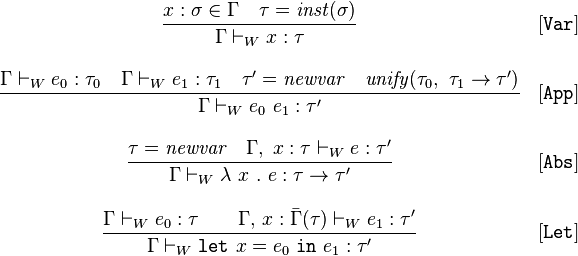

# Software and Programming Language Theory
## Static semantics
## Typing

<style>
.twocolumn {
  -moz-column-count: 2;
  -webkit-column-count: 2;
}
.small { font-size: small !important; }
.smaller { font-size: 0.8em !important; }
.large { font-size: 1.5em !important; }
.huge { font-size: 2em !important; }
</style>

Course page: https://maxxk.github.io/programming-languages-2016/
Contact author: maxim.krivchikov@gmail.com

# Literature
- R. Harper, Practical Foundations for Programming Languages, 2nd ed, 2016.

Examples of static semantics for dynamically-typed language in specification of ECMAScript: http://www.ecma-international.org/ecma-262/6.0/


# Typing
> The role of type system is to impose constraints on the formation of phrases that are sensitive to the context in which they occur.

In practice, typing is usually specified by means of the formal inference system:
- typing judgement "in context Γ the expression $x$ has type $τ$" — Γ ⊦ x : τ
- context Γ — set of typing judgement for already defined variables or expressions
- Γ, x : a ⊦ y : b

# Simply Typed Lambda Calculus
Type: $τ ≡ b \; | \; τ_1 → τ_2 $, $b$ is an element of the set of basic types.

Typing rules:
- $ \dfrac{c_α \text{— constant of type α}}{Γ ⊦ c : α}$

- $ \dfrac{Γ, x : σ ⊦ e : τ}{λx_σ.e : σ → τ}$,

- $ \dfrac{Γ ⊦ x : σ → τ, \qquad Γ ⊦ y : σ}{Γ ⊦ x_{σ → τ} · y_σ : τ}$

Derivation — tree of rule applications which starts from empty context and ends in typing derivation for required expression.

# Example from Harper's Practical Foundations...
Type: τ ≡ num | str

Expression: e ≡ x *(variable)* | n | s *(number and string literals)* |
e + f  *(addition)* | e ^ f *(concatenation)* | |e| *(length)* |
let x be e in f *(definition)*

Typing:
$\dfrac{}{Γ, x : τ ⊦ x : τ}$
$\dfrac{}{Γ ⊦ s : str}$
$\dfrac{}{Γ ⊦ n : num}$
$\dfrac{Γ ⊦ e : num \qquad Γ ⊦ f : num}{Γ ⊦ e + f : num}$
$\dfrac{Γ ⊦ e : str \qquad Γ ⊦ f : str}{Γ ⊦ e ^ f : str}$
$\dfrac{Γ ⊦ e : str}{Γ ⊦ |e| : num}$
$\dfrac{Γ ⊦ e : τ \qquad Γ, x : τ ⊦ f : σ}{Γ ⊦ \mathrm{let} \; x \; \mathrm{be} \; e \mathrm{in} f : σ}$

# Logical properties of typing
(usually are proved either by induction on rules or by induction on derivation)
**Unicity: ** *For every typing context Γ and expression e there exists at most one τ such that $Γ ⊦ e : τ$.*
We usually want this property in a sane type system, it may be neccessary to use a different statement in case of subtyping (not a single type, but a single minimal/maximal type).

**Inversion: ** *(example) If Γ ⊦ plus(a, b) : num then Γ ⊦ a : num, Γ ⊦ b : num. *
If typing rules are complex, such principles are difficult to state and prove. But these principle is essential for e.g. type inference.

# Structural properties of typing

**Weakening: ** If Γ ⊦ e : τ then Γ, x : σ ⊦ e : τ for x ∉ Γ.
(we may add to context any number of typing judgements which do not overwrite the types of existing variables)

**Contraction: ** $\dfrac{Γ, x : A, x : A ⊦ Σ}{Γ, x : A ⊦ Σ}$
(we may remove repeating judgements from context)

**Exchange: ** $\dfrac{Γ_1, x : A, Γ_2, y : B, Γ_3 ⊦ Σ}{Γ_1, y : B, Γ_2, x : A, Γ_3 ⊦ Σ}$
(independent typing judgements may change order in context)

**Substitution: ** If Γ, x : τ ⊦ e' : τ' and Γ ⊦ e : τ , then Γ ⊦ [e/x]e' : τ'
(expressions with the same type may be substituted)

**Decomposition: ** If Γ ⊦ [e/x]e' : τ' then for every τ such that Γ ⊦ e : τ, we have Γ, x : τ ⊦ e' : τ'
(we can factor out some typed value)

# Substructural type systems
Some type systems lack support for some of the mentioned structural properties.

## Linear types
Based on the linear logic, ensures that each object is used exactly once. I.e. all objects have static lifetime controlled by type system. Doesn't support weakening and contraction.

## Affine types
Linear types with weakening (some variables may stay unused)

# Affine types

In C++ affine types are implemented as `std::unique_ptr`:
```c++
std::unique_ptr<int> p1(new int(5));
std::unique_ptr<int> p2 = p1; //Compile error.
std::unique_ptr<int> p3 = std::move(p1); //Transfers ownership. p3 now owns the memory and p1 is rendered invalid.

p3.reset(); //Deletes the memory.
p1.reset(); //Does nothing.
```

<div class="small">See also: http://homepages.inf.ed.ac.uk/wadler/topics/linear-logic.html</div>

# Linear types
Clean programming language
```haskell
AppendAB :: File -> (File, File)
AppendAB file = (fileA, fileB)
where
    fileA = fwritec 'a' file
    fileB = fwritec 'b' file -- compile error
```

```haskell
WriteAB :: File -> File
WriteAB file = fileAB
where
    fileA = fwritec 'a' file
    fileAB = fwritec 'b' fileA
```


```haskell
AppendAorB :: Bool *File -> *File
AppendAorB cond file
    | cond = fwritec 'a' file
    | otherwise = fwritec 'b' file
```


# Type conversions
**Type conversion** — mapping from the values of one type to the corresponding values of a different type. For example, integers to floating point numbers: 1 → 1.0 or strings to codepoints to integers.

- **cast** — explicit type conversion
```c++
x = static_cast<int>('1');
```
```ada
x := Float(1);
```
- **coercion** — implicit type conversion, performed automatically.
```c++
double hilbert = 1 / (i + j + 1);
int pi = 3.141592653589793238462643383279502884197169399375105820974944592307816406;
```

# Type conversions
- some languages (Ada, Go) do not support any form of the coercion, some (Pascal) support only "lossless" coercions, others (C++, C#) even allow user-defined coercions.
```pascal
-- Pascal:
var n: Integer;   x: Real;
x := n;
n := x; -- error
n := round(x);
```

```ada
-- Ada:
n: Integer; x: Float;
x := n; -- error
n := x; -- error
x := Float(n);
n := Integer(x); -- rounding
```

`double` allow exact representation for 53-bit integers.

# Implicit coercions
<div class="smaller twocolumn">
```c#
public class Author
{
    public string First;
    public string Last;
    public string[] BooksArray;
}


public class Writer
{
    public string FirstName { get; set; }
    public string LastName { get; set; }
    public List<string> Books { get; set; }
}

```

<div class="small">Example from: http://www.codeproject.com/Articles/177153/Type-conversions-with-implicit-and-explicit-operat</div>

```c#
public static implicit operator Writer(Author a)
{
    return new Writer
    {
        FirstName = a.First,
        LastName = a.Last,
        Books = a.BooksArray != null ? a.BooksArray.ToList() : null
    };
}

Author a = new Author
{
    First = "Vijaya",
    Last = "Anand",
    BooksArray = new string[] { "book1" }
};
Writer w = a; //implicitly casting from Author to Writer.
```
</div>

# Type inference
In some languages it is possible to leave "holes" in place of type specifiers. Type checker tries to fill these holes in process of **type inference (type reconstruction).**

```c++
std::vector<std::map<int, bool>> m;
// ...
for (std::vector<std::map<int,bool>>::const_iterator it = v.begin();
  it != v.end(); ++it) { /* ... */ }

for (auto it=v.begin(); it != v.end(); ++it) {
  decltype(it) it2;
  /* ... */
}
```

# Type inference
```haskell
data List t = Nil | Cons (t, List t)

length l =
  case l of
    Nil -> 0
    Cons(x, xs) -> 1 + length(xs)


-- length :: List t -> Integer
```

# Hindley-Milner Algorithm W
Most well-known algorithm: Hindley-Milner Algorithm W.

Monotype: ordinary type, polytype has some type variables: ∀α.(Set α) → int



Sample implementations: https://github.com/tomprimozic/type-systems

# Algorithm W
```
unify(ta,tb):
  ta = find(ta)
  tb = find(tb)
  if both ta,tb are terms of the form D p1..pn with identical D,n then
    unify(ta[i],tb[i]) for each corresponding ith parameter
  else
  if at least one of ta,tb is a type variable then
    union(ta,tb)
  else
    error 'types do not match'
```

# Dynamic typing
Dynamically-typed languages do usually have typing semantics as a part of their dynamic semantics. But some things (such as type conversions) usually must be specified statically.

# Subtyping
- Row types, union types

# Implementation of typing
Static semantics environments → Typing environments

Typing judgements are represented as indexed inductive type constructor. To each typeable node of static semantics tree we must attach the corresponding typing judgement.

Example: http://mazzo.li/posts/Lambda.html
