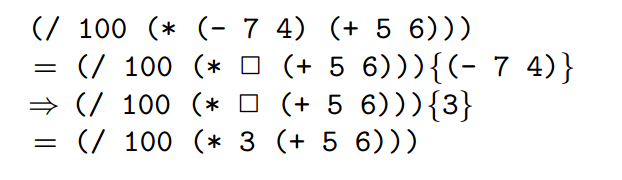

# Software and Programming Language Theory
## Dynamic semantics
## Operational sematics

<style>
.twocolumn {
  -moz-column-count: 2;
  -webkit-column-count: 2;
}
.small { font-size: small !important; }
.smaller { font-size: 0.8em !important; }
.large { font-size: 1.5em !important; }
.huge { font-size: 2em !important; }
.reveal section {
  text-align: left;
}
</style>

Course page: https://maxxk.github.io/programming-languages-2016/
Contact author: maxim.krivchikov@gmail.com

# Programming language specification
```{.graphviz .dot}
digraph Spec {
  edge [minlen=3.0];

  { rank=same; Syntax, Semantics, Pragmatics };
  { rank=same; "Static Semantics", "Dynamic Semantics"};
  { rank=same; "Operational Semantics"; "Denotational Semantics"; "Axiomatic Semantics"}
  Specification -> Syntax;
  Specification -> Semantics;
  Specification -> Pragmatics;
  Semantics -> "Static Semantics";
  Semantics -> "Dynamic Semantics";
  "Dynamic Semantics" -> "Operational Semantics";
  "Dynamic Semantics" -> "Denotational Semantics";
  "Dynamic Semantics" -> "Axiomatic Semantics";
}
```

# Dynamic semantics
— the semantics of the programming language statements at the run time.

## Approaches
### Operational Semantics
The meaning of the program is specified as a sequence of computational steps for some abstract machine.

### Axiomatic Semantics
The meaning of the program is defined in terms of effects on the program statements on assertions about the program state.

### Denotational Semantics
The meaning of the program is formalized as a mathematical object (denotation).

# Operational semantics
(the most direct for imperative programmer)
Program execution may be understood as a step-by-step process that evolves by mechanical application of a fixed set of rules.
Rules describe how language constructs affect the state of some *abstract machine* that provides the mathematical model of computation. Each state of the abstract machine is called *configuration*.

<div class="smaller">F. Turbak, D. Gifford. Design Concepts in Programming Languages. Chapter 3. Operational Semantics.</div>

# Operational execution model
```{.graphviz .dot}
digraph Operational {
  rankdir="LR";
  subgraph Execution{
    rankdir="TD";
    "Initial configuration", "Intermediate configuration 1", "Intermediate configuration k", "Final configuration"
  }
  { rank=same; rankdir="TD"; "Initial configuration", "Intermediate configuration 1", "Intermediate configuration k", "Final configuration"}
  Program -> "Input Function";
  Inputs -> "Input Function";
  "Input Function" -> "Initial configuration";
  "Initial configuration" -> "Intermediate configuration 1";
  "Intermediate configuration 1" -> "Intermediate configuration k";
  "Intermediate configuration k" -> "Final configuration";
  "Final configuration" -> "Output Function";
  "Output Function" -> "Answer";
}
```

# Big-step and small-step operational semantics
Small-step operational semantics (Structural Operational Semantics, SOS): step-by-step transformation of configurations in abstract machine is defined by set of rewrite rules.

<div class="smaller">Gordon D. Plotkin. A Structural Approach to Operational Semantics. (1981) Tech. Rep. DAIMI FN-19, Computer Science Department, Aarhus University, Aarhus, Denmark. (Reprinted with corrections in J. Log. Algebr. Program. 60-61: 17-139 (2004)</div>

Big-step operational semantics (natural semantics): program execution is described in terms of recursive evaluation of subphrases of a program. Each nontrivial syntactic domain (subset of abstract syntax tree constructors) has some specific evaluation relation.

# Structural operational semantics
## Set-theoretic abstract machine model
Consider programming language L with well-formed, well-typed programs P ∈ Prog, inputs I ∈ Inputs and answers A ∈ AnsExp.

Structural operational semantics for L is five-tuple S = 〈 CF, ⇒, FC, IF, OF 〉

* cf ∈ CF — __domain of configurations__ for an abstract machine
* ⇒ — __transition relation__, "⇒" ⊆ CF × CF. Two configurations are in transition relation iff there is a __(one step) transition__ from cf to cf'
cf ⇒ cf' ⇔ 〈 cf, cf' 〉 ∈ ⇒

$⇒^*$ — reflexive transitive closure of ⇒. Sequence of transitions cf $⇒^*$ cf' is called **transition path**.

Configuration cf is __reducible__ if there is some cf' such that cf ⇒ cf', otherwisf cf is __irreducible__.

Transition relation $⇒$ is __deterministic__ if for every cf there is exactly one $cf'$, otherwise ⇒ is __nondeterministic__.

# Structural operational semantics
Structural operational semantics for language L is five-tuple S = 〈 CF, ⇒, FC, IF, OF 〉
- Irreducible — all irreducible configurations
- FC — set of **final configurations** which yield the correct answer, FC ⊂ Irreducible
- Stuck = Irreducible / FC — set of stuck states, nonfinal irreducible configurations (e.g. error states)

- IF : (Prog × Inputs) → CF — **input function**, transforms a program and its inputs to an initial configuration

- OF : FC → AnsExp — **output function**, maps a program and its inputs to an initial configuration

# Program behavior
Outcome = AnsExp + ErrorResult (+ — disjoint union)

Deterministic behavior, if $⇒$ is deterministic:
$$
beh_{det} : (\mathrm{Prog} × \mathrm{Inputs}) → \mathrm{Outcome}
$$
$$
beh_{det} 〈 P, I 〉 = \left\{ \begin{array}{lcl}
AnsExp ↦ Outcome (OF cf) & \text{if } & IF 〈P, I〉 ⇒^* cf ∈ FC, \\
ErrorResult & \text{if } & IF 〈P, I〉 ⇒^* cf ∈ Stuck, \\
∞ & \text{if } & IF 〈P, I〉 ⇒^∞.
\end{array} \right.
$$

# Non-deterministic behavior
$\mathcal{P}(A)$ — powerset of $A$.

$$
beh : (\mathrm{Prog} × \mathrm{Inputs}) → \mathcal{P}(\mathrm{Outcome})
$$

$$
o ∈ beh( 〈P, I〉 ) \; \mathrm{if} \; \left\{ \begin{array}{lcl}
o = AnsExp ↦ Outcome (OF cf) & \text{and} & (IF 〈P, I〉 ⇒^* cf ∈ FC \\
o ∈ ErrorResult & \text{and} & IF 〈 P, I 〉 ⇒^* cf ∈ Stuck \\
o = ∞ & \text{and} & IF 〈P, I〉 ⇒^∞
\end{array}\right.
$$

# Rewrite rules
Usually relations on complex domains are specified in terms of **formal inference system.**

$$
\dfrac{antecedents}{consequences} [name]
$$

$antecedents = ⊘$ ⇒ rule is called **axiom**, otherwise **progress rule**.

Example axiom for stack-based language (placing constant on stack; configuration state = 〈 command sequence, stack 〉):

〈 N . Q, S〉 ⇒ 〈 Q, N . S 〉 [num]

If cf is a configuration in which first command in sequence is constant, then there is a transition from cf to cf' in which constant is moved from command sequence to the top of the stack.

# Example structural operational semantics execution


# Subexpression evaluation


# Evaluation contexts


# Big-step operational semantics
Big-step operational semantics (natural semantics): program execution is described in terms of recursive evaluation of subphrases of a program. Each nontrivial syntactic domain (subset of abstract syntax tree constructors) has some specific evaluation relation.

E.g. $ →_{NE}$ for numerical expressions and $→_{Prog}$ for programs.

# Big-step operational semantics


# Language properties
Usually operational semantics is used to prove some of the following properties:
* universality: the language can express all computable programs;
* determinism: the set of possible outcomes from executing a program on any
particular inputs is a singleton;
* strong normalization: all programs are guaranteed to terminate on all inputs
(i.e., it is not possible to express an infinite loop);
* static checkability: a class of program errors can be found by static analysis
without resorting to execution;
* referential transparency: different occurrences of an expression within the
same context always have the same meaning.

# Example proof of termination
Turbak, Gifford. p. 85
