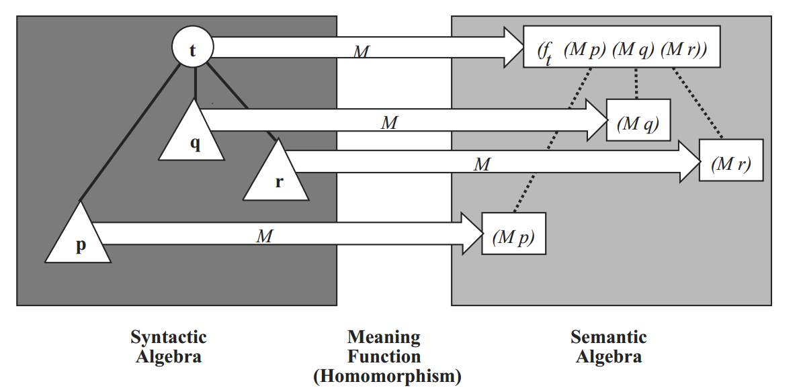
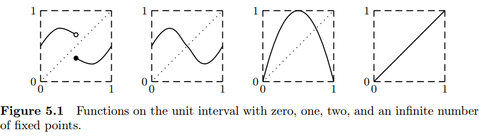

# Software and Programming Language Theory
## Denotational semantics
### Domain theory
<!--## Implementation of denotational semantics
### Monads and monad transformers-->
### Resumptions

<style>
.twocolumn {
  -moz-column-count: 2;
  -webkit-column-count: 2;
}
.small { font-size: small !important; }
.smaller { font-size: 0.8em !important; }
.large { font-size: 1.5em !important; }
.huge { font-size: 2em !important; }
.reveal section {
  text-align: left;
}

.xits {
  font-family: "XITS Math", "XITS", "STIX", "PT Serif Caption", sans-serif !important;
}
</style>

Course page: https://maxxk.github.io/programming-languages-2016/
Contact author: maxim.krivchikov@gmail.com

# Off-topic
An interesting paper introduced in blogpost yesterday: [The 8000th Busy Beaver number eludes ZF set theory: new paper by Adam Yedidia and me](http://www.scottaaronson.com/blog/?p=2725).
The authors constructed Turing machines the termination of which depends on some nontrivial foundational statements, with not-so-many states.

- 4888-state machine that halts iff (if and only if) there is a counterexample to Goldbach's Conjecture
- 5372-state machine that halts iff there is a counterexample to Riemann hypothesis
- 7918-state machine whose behavior can not be proven from the usual axioms of set theory under reasonable consistency hypothesis

# Some non-trivial parts of programming language semantics
1. Possible non-termination. Some languages allow possibly-infinite loops. Languages without non-termination have rather simple semantics.
**Operational semantics:** sequence of steps form the directed graph (execution trace), non-termination is represented as a loop in graph.

2. Non-determinism. In some languages (for example, C) the order of execution of some expressions (e.g. the evaluation order of arguments) is unspecified. Furthermore, threads parallel programming model is essentially non-deterministic.
**Operational semantics:** evaluation relations are many-valued.

# Denotational semantics: Literature

<div class="smaller">
1. R.W. Sebesta. Concepts of Programming Languages, 2012.
  Section 3.5.2. Denotational semantics (pp. 142–147)
  — concise practical introduction, good for getting first impression.

2. **F.A. Turbak, D.K. Gifford. Desing Concepts in Programming Languages, 2008.
  Section 4. Denotational semantics, Section 5. Fixed Points. (pp. 113–204)**

3. D.A. Schmidt. Denotational Semantics: A Methodology for Language Development. 1997.
  A monograph on denotational semantics.

4. N.S. Papaspyrou. A Formal Semantics for the C Programming Language. 1998.
  PhD thesis.

5. **D.S. Scott. Logics and programming languages. 1977 [doi:10.1145/359810.359826](http://dx.doi.org/10.1145/359810.359826)
    1976 ACM Turing Award Lecture. The creator of domain theory and denotational semantics describes the history and the essence of the theory to wide audience.**

6. Ю.Л. Ершов.
- Непрерывные решетки и A-пространства // Докл. АН СССР. — 1972. — Т. 207, No 3. — C. 523–526.
- Теория A-пространств // Алгебра и логика. — 1973. — T. 12, No 4. — C. 369–416.
</div>

# Denotational semantics
The core idea of denotational semantics is compositionality. «The meaning of the whole is composed out of the meaning of the parts».
Main parts:
1. **Syntactic algebra** — abstract syntax representation, AST in our notation. Describes the syntax of the program.

2. **Semantic algebra** — a collection of **semantic domains** along with functions that manipulate these domains. Models the meaning of program phrases.
Usually the meaning of a program is an element of a function domain that maps **context domains** (analogue of configuration space in operational semantics) to an **answer domain** (e.g. *Int* domain for programs which compute some integer value).

3. **Meaning function** maps the elements of the syntactic algebra to their meanings in the semantic algebra.

# Meaning function
Meaning function must be homomorphic under the AST composition.
E.g. if we have some AST node $t$ = $t(t_1, t_2, …, t_k)$ and globally defined meaning function $M$ then:
$$ M(t) = f_t (M(t_1), M(t_2), …, M(t_k)), $$
where $f_t$ is a function over the semantic domain determined by the syntactic class of $t$.


# Meaning function definition
The usual notation for meaning function is $ · _{\text{syntax-domain}}$.
The body of the meaning function is usually defined in terms of untyped lambda-calculus with some syntactic sugar:
- conditional operator **if** … **then** … **else** with condition as a (decidable) predicate over the semantic domain
- pattern matching operator **match** ▷ pattern1 ↦ result1 … **end**
- structural recursion: function can recursively call itself with arguments which are the structural parts of the original arguments

# Example: Imp'
Simple imperative language with arithmetical and boolean expressions, assignment, conditional operator and loop.

Abstract syntax (omitting the operator precedence and lexical structure):
```
Program = Statement "return" VariableName

Statement = VariableName "=" ArithmeticalExpression
| "skip"
| Statement (";" | "\n") Statement
| "if" "(" BooleanExpression ")" "{ " Statement " } else { " Statement " }"
| "while "(" BooleanExpression ")" "{ " Statement  "}"

ArithmeticalExpression = VariableName
| IntegerNumber
| "sqrt" ArithmeticalExpression
| "-" ArithmeticalExpression
| ArithmeticalExpression ("+" | "-" | "*" | "/" | "%") ArithmeticalExpression

BooleanExpression = ArithmeticalExpression ("<" | ">" | "==") ArithmeticalExpression
| "!" BooleanExpression
| BooleanExpression ("&&" | "||" | "^^")
```

# Imp' programs
1. `a`, `b`, `c` are the quadratic equation coefficients.
```
d = sqrt(b*b - 4*a*c)
x1 = (-b + d) / 2*a
x2 = (-b - d) / 2*a
if (x1 > x2) {
  res = x1
} else {
  res = x2
}
return res
```

2. Primality test for `n`. Returns `0` if `n` is prime, otherwise returns minimal `n` divisor.
```
bound = sqrt(n)
i = 2
divisor=0
while (i < bound && divisor == 0) {
  if (n % i == 0) { divisor = n } else { skip };
}
return divisor
```

# Naive denotational semantics
<div class="smaller">
## Semantic domains
*Int* — integer numbers with addition, subtraction, division, modulus and integral approximation to square root and boolean-valued comparison operators (usually you want integer numbers mod $2^32$ or $2^64$, but our language supports big integers).
*Bool* — boolean values (*true*, *false*) with logical operations.

## Expression semantics (without variables)
$ · _{\text{AE}} : \text{ArithmeticalExpression} → \text{Int}$
$ \text{IntegerNumber}(i) _{\text{AE}} = i_{\text{IntegerNumber}}$
$ \text{sqrt}(e) _{\text{AE}} = \left[ \sqrt{e_{\text{AE}}} \right] $
$ -e _{\text{AE}} = - e_{\text{AE}}$
$ e_1 \; aop \; e_2 _{\text{AE}} =op_{\text{AE-aop}} ( e_1 _{\text{AE}},  e_2_{\text{AE}})$ [e.g. $\texttt{}_{\text{AE-aop}} = \text{mod}$]

## Boolean expression semantics
abop — arithmetical-boolean operator, bbop — boolean-boolean operator.
$ · _{\text{BE}} : \text{BooleanExpression} → \text{Bool}$
$ e_1 \; abop \; e_2 _{\text{BE}} = abop (e_1_{\text{AE}}, e_2_{\text{AE}})$
$\texttt{!} b _{\text{BE}} = ¬  b $
$b_1 \; bbop \; b_2 _{\text{BE}} = bbop(b_1_{\text{BE}}, b_2_{\text{BE}})$
</div>

# Environments
Expressions have read-only access to variables. It is represented in terms of environment (additional argument to the meaning function).
**Semantic domain:** *VariableState ≡ Identifier → Int${}_⟂$,*  *Int${}_⟂$ = Int ∪ { ⟂ }* with bottom (⟂) value representing undefined variable state. We will discuss this construction later, for now let us just state that $f(x, ⊥) = f(⟂, x) = ⟂$ for all defined functions.

Update meaning functions:
$ · _{\text{AE}} : \color{red}{\text{VariableState} →} \text{ArithmeticalExpression} → \text{Int}\color{red}{{}_⟂}$
All previously defined cases are updated to pass an environment to nested functions, for example:
$ -e  = λ env . - e(env)$
Now we can define the variable getter expression:
$ \text{Identifier}(I)  = λ env. env(I)$

Boolean expressions also depend on variable values. Previously defined cases must me updated.
$ · _{\text{BE}} : \color{red}{\text{VariableState} →} \text{BooleanExpression} → \text{Bool}\color{red}{{}_⟂}$

# Exceptions
<div class="smaller">
Now let us remember that we have three operators (`/, %, sqrt`) which are not universally defined over the integer numbers.
**Semantic domains:**
- errors: *Error = { div-by-zero, sqrt-from-negative }*
- domain sum constructor: *X + Error* are the values of either *X* or *Error*, with constructor *inl* converting *X* values to sum, constructor *inr* converting *Error* values to the sum.

**Convenience function:**
withLeft : (f : X → Y) → X + Error → Y + Error
withLeft(f, x) = **match**(x)  
▷ *inl* a ↦ f(a)
▷ *inr* e ↦ e
**end**

**Meaning functions:**
$ · _{\text{AE}} : \text{VariableState} → \text{ArithmeticalExpression} → \text{Int}_⟂ + \text{Error}$
$ · _{\text{BE}} : \text{VariableState} → \text{BooleanExpression} → \text{Bool}_⟂ + \text{Error}$

**Example meaning function update:**
$ -e  = λ env . \text{withLeft}(λx.-x, e(env))$

</div>

# Statement and program semantics
## Program
— receive the arguments and run statements. If statements completed without an error, get the return value.
$ · _{\text{P}} : \text{VariableState} → \text{Int}_⊥ + \text{Error}$
$ s_1 ; \; \texttt{return} \; I  = λ args. \text{withLeft}(λenv . env(I), s_1(args))$

## Statement
Statements manipulate the variable environment not as a read-only environment, but as a read-write state.
$ · _{\text{S}} : \text{VariableState} → \text{VariableState} + \text{Error}$
$ \texttt{skip}  = λenv. \text{inl}(env)$
$ s_1 \; \texttt{;} \; s_2  = λ env. \text{withLeft}(s_2, s_1(env))$
$ I \; \texttt{=} \; e  = λ env. \text{withLeft}(λi. (λJ. \text{if J=I return i else return env(J)}), e(env))$

# Statements (2)
Let us adopt two shorthand notations for withLeft:
- left composition: x >>= y  ≡  withLeft(y, x)
- left variable binding: a ← b; S  ≡  withLeft(λa. S, b)

$ \texttt{if} \; b_1 \; s_t \; s_f  = λ env. b' ← b_1(env) ;$
$\qquad$ **if** $(b' =_{\text{Bool}} \text{true})$  $s_t(env)$
$\qquad$ **else** $s_f(env)$

. . .

$ \texttt{while} \; b \; s  = λ env. b' ← b(env) ; $
$\qquad$ **if** $(b' =_{\text{Bool}} \text{false})$ $env$
$\qquad$ **else** $ s (env) >>= \color{red}{\textbf{???}}$

How can we define the meaning of the `while` loop? We can't just remove the structural recursion requirement: we may define terms with bad behavior in lambda-calculus.


# Fixed point semantics
Usually complex recursive functions may be defined by the means of the **fixed point combinator** and the **generating function.**

Example: factorial:
$$n! = \left\{ \begin{array}{l}
1, \text{if } n=0 \\
n · (n-1)!, \text{otherwise}
\end{array}\right.
$$

Generating function accepts the recursive call as another argument:
genFact = λ \color{red}{fact} . λ n .
$\qquad$ **if** n = 0 **return** 1
$\qquad$ **else** **return** n · fact(n)

Suppose we call genFact first with identity function and then — by applying the genFact to result:
$f_1 = \text{genFact}(λn.n)$, $f_2 = \text{genFact}(f_1)$, …, $f_k = \text{genFact}(f_k)$, …
For some good-behaving generating functions (or for some good starting arguments) such a sequence will have **fixed points:**
$f_∞$ is a fixed point of genFact iff genFact($f_∞$) = $f_∞$.

# Fixed points
For the function [0, 1] → [0, 1]:


To define a proper recursive function we need to find a solution to the recursive equation: gen($f_∞$) = $f_∞$. Under what conditions does this equation have a solution and how can we construct it?

# Least fixed point
We need something like this, but for our lambda-definable function space:
**Banach Fixed Point Theorem.** Let (X, d) be a non-empty complete metric space with a contraction mapping T : X → X. Then T admits a unique fixed-point x\* in X (i.e. T(x\*) = x\*). Furthermore, x\* can be found as follows: start with an arbitrary element $x_0$ in X and define a sequence {$x_n$} by $x_n$ = T($x_{n−1}$), then $x_n$ → x\*.

The main contribution of D. Scott and Yu. L. Ershov which allows us to call them the creators of the denotational semantics is the construction which allows fixed points for some (*continuous*) functions.

# Partial order
**Partial order** is a pair (D, ⩽) of a domain D and binary ordering relation ⩽ that is:
- reflexive (a ⩽ a)
- transitive (a ⩽ b, b ⩽ c ⇒ a ⩽ c)
- antisymmetric (a ⩽ b, b ⩽ a ⇒ a = b)


Pair of elements in D which are not in the ordering relation are called **incomparable**.
Trivial example: discrete order in which all elements are incomparable. For Bool domain we usually define a discrete partial order.
Partial order is **total order** if there is no incomparable elements.

**Upper bound** of subset X ⊆ D is an element u ∈ D that is "greater" (stronger) than any element in X:
∀ x ∈ X, x ⩽ u.

Some subsets may have even the **least upper bound** (upper bound which is "less" (weaker) than any other upper bound).

(and antisymmetrical **lower bound** and **greatest lower bound**)

# Partial order lifting
**Bottom** element (⊥) is such an element which is weaker than any element in D, **top** element (⊤) is such an element which is stronger than any element in D.

Natural numbers ℕ with usual ordering have bottom element (0 or 1) but no top element. Discrete partial orders have neither.

Any partial order D may be **lifted** to another partial order D${}_⊥$ that has all elements and orderings of D, but introduces new bottom element $⊥$. Lifted discrete partial order is called **flat** partial order.

# Partial order over constructors
We can define the partial order over simple (non-dependent) type constructors:

**Product:** (d, e) ∈ D × E; (d, e) ⩽ (d', e') iff d ⩽ d' and e ⩽ e'
**Sum:** A+B; $\qquad$ *inl* a ⩽ *inl* a' iff a ⩽ a'; $\qquad$ *inr* b ⩽ *inr* b' iff b ⩽ b'.
**Function:** f, g ∈ D → E; $\qquad$ f ⩽ g iff ∀ d ∈ D, f(d) ⩽ g(d).
**Sequence:** $D^*$
- **prefix ordering**
- **sum-of-products ordering**
**Powerdomain:** $2^D$, sets of all subsets under the subset ordering.

# Complete partial orders (CPOs)
**Chain** is totally ordered nonempty subset of partial orer.
Partial order D is **compete** iff every chain in D has least upper bound (limit).

Example: partial order *Bool*${}^*$ is not CPO under the prefix ordering, because the chain {[], [true], [true, true], …} has the infinite sequence of *true* as a limit, which is not a finite sequence.
We can extend it with *Bool*${}^∞$ (set of all infinite boolean sequences), so that Bool${}^*$ ∪ Bool${}^∞$ = $\overline{\text{Bool}^*}$ is a CPO

**Theorem. ** For any CPOs D, E we can define the following CPOs under the defined orderings:
$D_⟂$, $D × E$, $D + E$, $D → E$, $D^*$ (under the sum-of-products ordering), $\overline{D}$ (under the prefix ordering).

# Pointedness
A partial order is **pointed** if it has a bottom element.

**Theorem. ** For any *partial orders* D, E:
$D_⟂$ is pointed,
$D × E$ is pointed iff both D and E are pointed
$D + E$ is never pointed
$D → E$ is pointed iff E is pointed
$D^*$ under the sum-of-products ordering is never pointed
$D^*$ and $\overline{D^*}$ under the prefix ordering are always pointed.

# Monotonicity and continuity
$f : D → E$ is **monotonic** (D, E are CPOs) iff x ⩽ y ⇒ f(x) ⩽ f(y).
$f : D → E$ is **continuous** iff for any chain C ⊆ D, f(lub(C)) = lub({f(c) | c ∈ C})

**Theorem. ** On finite CPOs (+ infinite CPOs with only finite chains) monotonicity implies continuity.
On any CPO continuity implies monotonicity.

# Least Fixed Point Theorem
**Theorem. ** If D is a pointed CPO, then a continuous function
f : D → D
has a least fixed point **fix**(f) defined by lub{$f^n$(⟂), n ⩾ 0}.

So, if we can prove our function is

# Homework assignments
**Task 9.1** \*\* Extend the Imp' denotational semantics with `break` and `continue` loop control statements.

**Task 9.2** \* Define the big-step operational semantics for Imp' and make a short qualitative (textual) comparison between two definitions.

**Task 9.3** \* Define a continuous meaning function for `while` loops in Imp'.

Exercises in chapter 5 of [2] will pass as a one star each.
