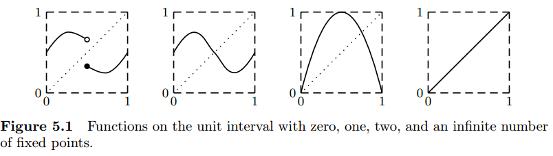

# Software and Programming Language Theory
## Denotational semantics implementation
### Monads
### Monad Transformers
### Effects
## Domains and Fixed point semantics

<style>
.twocolumn {
  -moz-column-count: 2;
  -webkit-column-count: 2;
}
.small { font-size: small !important; }
.smaller { font-size: 0.8em }
.large { font-size: 1.5em !important; }
.huge { font-size: 2em !important; }

.xits {
  font-family: "XITS Math", "XITS", "STIX", "PT Serif Caption", sans-serif !important;
}
.my-code, .my-code p {
  white-space: pre-wrap;
  text-indent: 0 !important;
  line-height: 0.6 !important;
}
</style>

Course page: https://maxxk.github.io/programming-languages/
Contact author: maxim.krivchikov@gmail.com

# Previous class: Imp'
Simple imperative language with arithmetical and boolean expressions, assignment, conditional operator and loop.

Abstract syntax (omitting the operator precedence and lexical structure):

```
Program = Statement "return" VariableName

Statement = VariableName "=" ArithmeticalExpression
| "skip"
| Statement (";" | "\n") Statement
| "if" "(" BooleanExpression ")" "{ " Statement " } else { " Statement " }"
| "while "(" BooleanExpression ")" "{ " Statement  "}"

ArithmeticalExpression = VariableName
| IntegerNumber
| "sqrt" ArithmeticalExpression
| "-" ArithmeticalExpression
| ArithmeticalExpression ("+" | "-" | "*" | "/" | "%") ArithmeticalExpression

BooleanExpression = ArithmeticalExpression ("<" | ">" | "==") ArithmeticalExpression
| "!" BooleanExpression
| BooleanExpression ("&&" | "||" | "^^")
```

# Previous class: Imp' programs
1. `a`, `b`, `c` are the quadratic equation coefficients.
```
d = sqrt(b*b - 4*a*c)
x1 = (-b + d) / 2*a
x2 = (-b - d) / 2*a
if (x1 > x2) {
  res = x1
} else {
  res = x2
}
return res
```

2. Primality test for `n`. Returns `0` if `n` is prime, otherwise returns minimal `n` divisor.
```
bound = sqrt(n)
i = 2
divisor=0
while (i < bound && divisor == 0) {
  if (n % i == 0) { divisor = n } else { skip };
}
return divisor
```

# Denotational semantics implementation
Evolution of statement meaning function for Imp' (from previous class):

1. Trivial case

$ · _{\text{S}} : \text{VariableState} → \text{VariableState}$

$ \texttt{skip}  = λenv. env$

2. Exceptions possible during expression evaluation.

New notation: domain of answers $\mathbf{A} =  \text{VariableState} + \text{Error}$

$ · _{\text{S}} : \text{VariableState} → \mathbf{A}$

$ \texttt{skip}  = λenv. \text{inl}(env)$

3. Continuations for complex control flow, conceptually. 

 $ · _{\text{S}} : \text{VariableState} → (c_{break} : \text{VariableState} → \mathbf{A}) →$

 $\qquad → (c_{continue} : \text{VariableState} → \mathbf{A}) → \mathbf{A}$

$ \texttt{skip}  = λenv.c_{break}.c_{continue}.\text{inl}(env)$

# Denotational semantics implementation
Finally, for a real language we end up with four meaning functions for statements.

(Source: N. Papaspyrou. A Formal Semantics for the C Programming Language).

Note that almost a half of the domains employed are not simply-constructed, they are defined as the application of an argument to a domain-generating function.


We need an approach to split the semantics to some modular functions.

# Imp' expression semantics
Under normal circumstances we do not care about exceptions if they are passed through the normal computation flow, we even defined `withLeft` function for it:

```
withLeft : (f : X → Y) → X + Error → Y + Error
withLeft(f, x) = match(x)  
▷ inl a ↦ f(a)
▷ inr e ↦ e
end
```

- left composition: x >>= y  ≡  withLeft(y, x)
- left variable binding: a ← b; S  ≡  withLeft(λa. S, b)

$ -e  = λ env . x ← e(env) ; -x$

$ \text{Identifier}(I)  = λ env. \text{inl}(env(I))$

# ...
Now let us mark the following three parts of our notation:

1. The **type constructor** wraps a value in some way:

$· \, + \text{Error} : \text{Type} → \text{Type}$

2. **inl injection operator** lets us wrap an actual computation result to fit an application result of the type constructor:

$\text{inl} : A → A + \text{Error}$

3. **withLeft' binding function** allows us to transform the wrapped value by function defined only on the unwrapped values:

withLeft' : (f : X → Y + Error) → X + Error → Y + Error

. . .

These two functions (inl and withLeft') have some nice compositional properties:

1. inl is a neutral element of withLeft':
    - (inl a) >>= f **=** f(a)
    - w >>= inl **=** v

2. Binding has some kind of composition rule:

(w >>= f) >>= g **=** w >>= (λ x. f(x) >>= g)

# Monad {.center}
We are ready to define the notion of monad as a generalization of the presented construction.

**Type constructor**
<div class="twocolumn">
<div>M : Type → Type</div>
<div>$· \, + \text{Error} : \text{Type} → \text{Type}$</div>
</div>
**injection operator**
<div class="twocolumn">
<div>return : A → M A</div>
<div>$\text{inl} : A → A + \text{Error}$</div>
</div>
**binding function**
<div class="twocolumn">
<div>bind : (A → M B) → M A → M B
<div style="visibility:hidden">alignment</div>
</div>
<div>withLeft' : (f : X → Y + Error) → X + Error → Y + Error</div>
</div>

# Monad {.center}


**monad laws** 

neutrality
<div class="twocolumn">
<div>
(return x) >>= f **=** f(x)
m >>= return **=** m
</div>
<div>
(inl a) >>= f **=** f(a)
 w >>= inl **=** v
</div>
</div>
composition
<div class="twocolumn">
<div>
(w >>= f) >>= g **=** w >>= (λ x. f(x) >>= g)
</div>
<div>
(w >>= f) >>= g **=** w >>= (λ x. f(x) >>= g)
</div>
</div>

# Monad {.smaller}
Monad is a type constructor (wrapper) with two functions which satisfy the monad laws. 
Injection operator (`return` function) allows us to "jump into the monad". 
The binding function `bind` allows us to define the monadic functions by the means of functions over the original domain (hiding the internal structure of the wrapper). Remember that the result type is a parameter.

We can also define some helper functions operating on the low level (working with internal structure of the wrapper). 
Examples for our exception definition:

<div class="twocolumn">
throw : Error → A + Error

throw ≡ inr


catch : A + Error → (Error → A + Error) → A + Error

catch ≡ λ *res*. *handler*. **match**(res)  

▷ *inl* a ↦ res

▷ *inr* e ↦ handler(e)

**end**


 a / b  ≡ λ env.a.b. A ← a(env) ;

B ← b(env) ;

 **match**(B)

▷ 0 ↦ throw division-by-zero

▷ n ↦ return $A \; /_ℤ \; n$

**end**
</div>

# Standard monads
We can equip simpe type constructors with two functions which satisfy the monad laws and get standard monads. Examples from Haskell `mtl` library. 


## Exception monad

```
Exception E A = A + E 
return x = inl x 
bind f x= match(x)  
▷ *inl* a ↦ f(a) 
▷ *inr* e ↦ e 
end 

throw : Error → A + Error
catch : A + Error → (Error → A + Error) → A + Error
```


# Standard monads
## Reader monad
The read-only environment

```
Reader R A = R → A
return x = λ env. x
bind f x = λ env. f(x(env))
```

```
ask : Reader R A (get local state)
local : (R → R) → Reader R A → Reader R A (locally modify environment)
reader : (R → A) → Reader R A (get an environmet)
```

# Standard monads
## Writer monad
Models write-only output (logging, tracing).

```
0 : W
⊕ : W → W → W
⊕ is associative
```

```
Writer W A = A × W
return x = (x, 0)
bind f x = let (y, w) = f(fst x) in (y, snd x + w)
```

```
tell : W → Writer W True
listen : Writer W A → Writer W (A × W)
pass : Writer W (A × (W → W)) → Writer W A
```

# Standard monads
## State monad
Models the mutable state.

```
State S A = S → A × S
return x = λ s. (x, s)
bind f x = λ s. let (x', s') = x in (f(x'), s')
```

```
get : State S S 
put : S → State S ()
modify : (S → S) → State S ()
gets : (S → A) → State S A
```


# Standard monads
## List monad
Models the nondeterminism.

```
List A 
return x = [x]
bind f x = map f x
```

(helpers — all the standard functions of the list type) 

# Standard monads
## Continuation monad
Models a complex control flow.

```
Cont R A = (A → R) → R
return x = λ k . k(x)
bind f x = λ k . x(λ m. f(m)(k))
```
 
```
x : (A → R) → R
f : A → (B → R) → R
bind f x : Cont R B = (B → R) → R
```

<div class="my-code">
callCC : ((A → Cont R B) → Cont R A) → Cont R A
</div>


See also: https://gist.github.com/edsko/6bf6e8c93a2d1e7941b9

# Category-theoretical definition {.smaller}

[A monad is just a monoid in category of endofunctors :)](http://james-iry.blogspot.ru/2009/05/brief-incomplete-and-mostly-wrong.html)

See textual descriptions at: https://funcool.github.io/cats/latest/#user-guide

See also: http://stackoverflow.com/questions/7220436/good-examples-of-not-a-functor-functor-applicative-monad/7220865


# Monad transformers
Monad transformer is the following construction:

A transformer for type constructor:

t : (Type → Type) → Type → Type

A way to obtain monad implementations for transformed monads:

∀ m, Monad m → Monad (t m)

Lifting operator:

```
lift : ∀ (a : Type), m a → (t m) a
lift . return = return
lift (m >>= k) = (lift m) >>= (lift ∘ k)
```

The purpose of the monad transformer is to obtain a single object representing a stack of monads.

# Extensible Effects
http://okmij.org/ftp/Haskell/extensible/index.html

http://docs.idris-lang.org/en/latest/effects/ 

# Domains and Fixed Points

# Loop semantics

```
 while b s  = λ env. b' ← b(env) ; 
  if b' = false
    env
  else  s (env) >>= ???
```

How can we define the meaning of the `while` loop? We can't just remove the structural recursion requirement: we may define terms with bad behavior in untyped lambda-calculus.


# Fixed point semantics
Usually complex recursive functions may be defined by the means of the **fixed point combinator** and the **generating function.**

Example: factorial:

```
n! = 1 if n=0
n! = n · (n-1)! otherwise
```

Generating function accepts the recursive call as another argument:

```
genFact = λ fact . λ n .
  if n = 0
    return 1
  else 
    return n · fact(n)

```

Suppose we call genFact first with identity function and then — by applying the genFact to result:

$f_1 = \text{genFact}(λn.n)$, $f_2 = \text{genFact}(f_1)$, …, $f_k = \text{genFact}(f_{k-1})$, …

For some good-behaving generating functions (or for some good starting arguments) such a sequence will have **fixed points:**

$f_∞$ is a fixed point of genFact iff genFact($f_∞$) = $f_∞$.

# Fixed points
For the function [0, 1] → [0, 1]:


To define a proper recursive function we need to find a solution to the recursive equation: gen($f_∞$) = $f_∞$. Under what conditions does this equation have a solution and how can we construct it?

# Least fixed point

We need something like the following theorem, but for our lambda-definable function space:

**Banach Fixed Point Theorem.** Let (X, d) be a non-empty complete metric space with a contraction mapping T : X → X. Then T admits a unique fixed-point x\* in X (i.e. T(x\*) = x\*).

Furthermore, x\* can be found as follows: start with an arbitrary element $x_0$ in X and define a sequence {$x_n$} by $x_n$ = T($x_{n−1}$), then $x_n$ → x\*.

The main contribution of D. Scott and Yu. L. Ershov which allows us to call them the creators of the denotational semantics is the construction which allows fixed points for some (*continuous*) functions.

# Partial order
**Partial order** is a pair (D, ⩽) of a domain D and binary ordering relation ⩽ that is:

- reflexive (a ⩽ a)
- transitive (a ⩽ b, b ⩽ c ⇒ a ⩽ c)
- antisymmetric (a ⩽ b, b ⩽ a ⇒ a = b)


Pair of elements in D which are not in the ordering relation are called **incomparable**.
Trivial example: discrete order in which all elements are incomparable. For `Bool` domain we usually define a discrete partial order.
Partial order is **total order** if there is no incomparable elements.

**Upper bound** of subset X ⊆ D is an element u ∈ D that is "greater" (stronger) than any element in X:

∀ x ∈ X, x ⩽ u.

Some subsets may have even the **least upper bound** (upper bound which is "less" (weaker) than any other upper bound).

(and antisymmetrical **lower bound** and **greatest lower bound**)

# Partial order lifting
**Bottom** element (⊥) is such an element which is weaker than any element in D, **top** element (⊤) is such an element which is stronger than any element in D.

Natural numbers ℕ with usual ordering have bottom element (0 or 1) but no top element. Discrete partial orders have neither.

Any partial order D may be **lifted** to another partial order D${}_⊥$ that has all elements and orderings of D, but introduces new bottom element $⊥$. Lifted discrete partial order is called **flat** partial order.

# Partial order over constructors
We can define the partial order over simple (non-dependent) type constructors:

**Product:** (d, e) ∈ D × E; (d, e) ⩽ (d', e') iff d ⩽ d' and e ⩽ e'

**Sum:** A+B; $\qquad$ *inl* a ⩽ *inl* a' iff a ⩽ a'; $\qquad$ *inr* b ⩽ *inr* b' iff b ⩽ b'.

**Function:** f, g ∈ D → E; $\qquad$ f ⩽ g iff ∀ d ∈ D, f(d) ⩽ g(d).

**Sequence:** $D^*$

- **prefix ordering**
- **sum-of-products ordering**

**Powerdomain:** $2^D$, sets of all subsets under the subset ordering.

# Complete partial orders (CPOs)

**Chain** is totally ordered nonempty subset of partial orer.

Partial order D is **complete (CPO)** iff every chain in D has least upper bound (limit).

Example: partial order *Bool*${}^*$ is not CPO under the prefix ordering, because the chain {[], [true], [true, true], …} has the infinite sequence of *true* as a limit, which is not a finite sequence.

We can extend it with *Bool*${}^∞$ (set of all infinite boolean sequences), so that Bool${}^*$ ∪ Bool${}^∞$ = ${\mathbf{Bool}^*}$ is a CPO

**Theorem. ** For any CPOs D, E we can define the following CPOs under the defined orderings:
$D_⟂$, $D × E$, $D + E$, $D → E$, $D^*$ (under the sum-of-products ordering), $\mathbf{D}$ (under the prefix ordering).

# Pointedness
A partial order is **pointed** if it has a bottom element.

**Theorem. ** For any *partial orders* D, E:

- $D_⟂$ is pointed,
- $D × E$ is pointed iff both D and E are pointed
- $D + E$ is never pointed
- $D → E$ is pointed iff E is pointed
- $D^*$ under the sum-of-products ordering is never pointed
- $D^*$ and $D^* ∪ D^∞$ under the prefix ordering are always pointed.

# Monotonicity and continuity
$f : D → E$ is **monotonic** (D, E are CPOs) iff x ⩽ y ⇒ f(x) ⩽ f(y).

$f : D → E$ is **continuous** iff for any chain C ⊆ D, f(lub(C)) = lub({f(c) | c ∈ C})

In some sense least upper bounds and chains over CPOs are related in the same way as limits and filter bases in calculus.

**Theorem. ** On finite CPOs (+ infinite CPOs with only finite chains) monotonicity implies continuity.
On any CPO continuity implies monotonicity.

# Least Fixed Point Theorem
**Theorem. ** If D is a pointed CPO, then a continuous function
f : D → D
has a least fixed point **fix**(f) defined by lub{$f^n$(⟂), n ⩾ 0}.

So, if we can prove our function is continuous, we can use fixed point combinators.

Example:

genFact : (fact : ℕ → ℕ) → ℕ → ℕ
```
genFact = λ fact . λ n .
  if n = 0
    return 1
  else 
    return n · fact(n)
```

Use discrete order on ℕ and lift function to $ℕ_⊥$. Function space $ℕ_⊥ → ℕ_⊥$ is a CPO with order:

f ⩽ g ⇔ ∀ x : f(x) ⩽ g(x).

genFact is monotonic and continuous in $ℕ_⊥ → ℕ_⊥$, so we may use least fixed point operator.


# Monads bibliography
1. Moggi E. Notions of computation and monads // Information and Computation. 1991. Vol. 93, № 1. P. 55–92.
2. Harrison W. Cheap (but functional) threads //  [Online](https://www.researchgate.net/profile/William_Harrison6/publication/245648551/links/546b682b0cf2f5eb18091caa.pdf)
3. Danielsson N.A. Operational Semantics Using the Partiality Monad // Proceedings of the 17th ACM SIGPLAN International Conference on Functional Programming. New York, NY, USA: ACM, 2012. P. 127–138.
4. Papaspyrou N.S. A Resumption Monad Transformer and its Applications in the Semantics of Concurrency: CSD-SW-TR-2-01. Athenes, Greece: National Technical University of Athens, School of Electrical and Computer Engineering, Software Engineering Laboratory, 2001.

Some of previously discussed papers also use the monads, for example:
5. Danielsson N.A. Total parser combinators // Proceedings of the 15th ACM SIGPLAN international conference on Functional programming - ICFP ’10. ACM Press, 2010. P. 285–285. 

Monad transformers: 
6. Liang S., Hudak P., Jones M. Monad Transformers and Modular Interpreters // Conference Record of POPL'95: 22nd ACM SIGPLAN-SIGACT Symposium on Principles of Programming Languages, San Francisco, CA, January 1995. 

Extensible effects: 
7. [Papers on the page linked from previous presentation](http://okmij.org/ftp/Haskell/extensible/index.html)
8. [Idris tutorial on the programming with effects](http://docs.idris-lang.org/en/latest/effects/index.html)

# Homework assignments
**Task 9.1** \*\* Extend the Imp' denotational semantics with `break` and `continue` loop control statements (use continuation monad).

**Task 9.2** \*\* Define the big-step operational semantics for Imp' and make a short qualitative (textual) comparison between two definitions.

**Task 9.3** \*\* Define a continuous meaning function for `while` loops in Imp'.

**Task 9.4** \*\*\* For all "Standard monads" in this presentation prove that operators and helper functions are continuous.

**Task 9.5** \* Exercise 5.10 in Turbak, Gifford.
