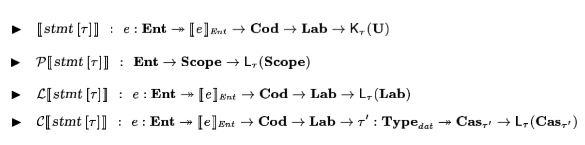

# Software and Programming Language Theory
## Denotational semantics implementation
### Monads
### Monad Transformers
### Effects
## Equational reasoning

<style>
.twocolumn {
  -moz-column-count: 2;
  -webkit-column-count: 2;
}
.small { font-size: small !important; }
.smaller { font-size: 0.8em !important; }
.large { font-size: 1.5em !important; }
.huge { font-size: 2em !important; }
.reveal section {
  text-align: left;
}
.reveal section.center {
  text-align: center;
}

.xits {
  font-family: "XITS Math", "XITS", "STIX", "PT Serif Caption", sans-serif !important;
}
</style>

Course page: https://maxxk.github.io/programming-languages-2016/
Contact author: maxim.krivchikov@gmail.com

# Denotational semantics implementation
Evolution of statement meaning function for Imp' (from previous class):
1. Trivial case
$ · _{\text{S}} : \text{VariableState} → \text{VariableState}$
$ \texttt{skip}  = λenv. env$
2. Exceptions possible during expression evaluation.
New notation: domain of answers $\mathbf{A} =  \text{VariableState} + \text{Error}$
$ · _{\text{S}} : \text{VariableState} → \mathbf{A}$
$ \texttt{skip}  = λenv. \color{red}{\text{inl}}(env)$
3. (Task 9.1 hint) Continuations for complex control flow, conceptually. 
 $ · _{\text{S}} : \text{VariableState} → (c_{break} : \text{VariableState} → \mathbf{A}) →$
 $\qquad → (c_{continue} : \text{VariableState} → \mathbf{A}) → \mathbf{A}$
 $ \texttt{skip}  = λenv.\color{red}{c_{break}.c_{continue}}.\text{inl}(env)$
...and so on (goto, input/output, dynamic memory allocation, non-determinism) ...

# Denotational semantics implementation
Finally, for a real language we end up with four meaning functions for statements.
(Source: N. Papaspyrou. A Formal Semantics for the C Programming Language).
Note that almost a half of the domains employed are not simply-constructed, they are defined as the application of an argument to a domain-generating function.


We need an approach to split the semantics to some modular functions.

# Imp' expression semantics
Under normal circumstances we do not care about exceptions if they are passed through the normal computation flow, we even defined `withLeft` function for it:

withLeft : (f : X → Y) → X + Error → Y + Error
withLeft(f, x) = **match**(x)  
▷ *inl* a ↦ f(a)
▷ *inr* e ↦ e
**end**

- left composition: x >>= y  ≡  withLeft(y, x)
- left variable binding: a ← b; S  ≡  withLeft(λa. S, b)

$ -e  = λ env . x ← e(env) ; -x$
$ \text{Identifier}(I)  = λ env. \text{inl}(env(I))$

# ...
Now let us mark the following three parts of our notation:
1. The **type constructor** wraps a value in some way:
$· \, + \text{Error} : \text{Type} → \text{Type}$
2. **inl injection operator** lets us wrap an actual computation result to fit an application result of the type constructor:
$\text{inl} : A → A + \text{Error}$
3. **withLeft' binding function** allows us to transform the wrapped value by function defined only on the unwrapped values:
withLeft' : (f : X → Y + Error) → X + Error → Y + Error

. . .

These two functions (inl and withLeft') have some nice compositional properties:
1. inl is a neutral element of withLeft':
    - (inl a) >>= f **=** f(a)
    - w >>= inl **=** v
2. Binding has some kind of composition rule:
(w >>= f) >>= g **=** w >>= (λ x. f(x) >>= g)

# Monad {.center .smaller}
We are ready to define the notion of monad as a generalization of the presented construction.
**Type constructor**
<div class="twocolumn">
<div>M : Type → Type</div>
<div>$· \, + \text{Error} : \text{Type} → \text{Type}$</div>
</div>
**injection operator**
<div class="twocolumn">
<div>return : A → M A</div>
<div>$\text{inl} : A → A + \text{Error}$</div>
</div>
**binding function**
<div class="twocolumn">
<div>bind : (A → M B) → M A → M B
<div style="visibility:hidden">alignment</div>
</div>
<div>withLeft' : (f : X → Y + Error) → X + Error → Y + Error</div>
</div>

**monad laws** 
neutrality
<div class="twocolumn">
<div>
(return x) >>= f **=** f(x)
m >>= return **=** m
</div>
<div>
(inl a) >>= f **=** f(a)
 w >>= inl **=** v
</div>
</div>
composition
<div class="twocolumn">
<div>
(w >>= f) >>= g **=** w >>= (λ x. f(x) >>= g)
</div>
<div>
(w >>= f) >>= g **=** w >>= (λ x. f(x) >>= g)
</div>
</div>

# Monad {.smaller}
Monad is a type constructor (wrapper) with two functions which satisfy the monad laws. 
Injection operator (`return` function) allows us to "jump into the monad". 
The binding function `bind` allows us to define the monadic functions by the means of functions over the original domain (hiding the internal structure of the wrapper).
Remember that the result type is a parameter.

We can also define some helper functions operating on the low level (working with internal structure of the wrapper). 
Examples for our exception definition:

throw : Error → A + Error
throw ≡ inr

catch : A + Error → (Error → A + Error) → A + Error
catch ≡ λ *res*. *handler*. **match**(res)  
▷ *inl* a ↦ res
▷ *inr* e ↦ handler(e)
**end**

 a `/` b  ≡ λ env.a.b. A ← a(env) ;
B ← b(env) ;
 **match**(B)
▷ 0 ↦ throw division-by-zero
▷ n ↦ return $A \; /_ℤ \; n$
**end**

# Standard monads
We can equip simpe type constructors with two functions which satisfy the monad laws and get standard monads. Examples from Haskell `mtl` library. 


## Exception monad
Exception E A = A + E
return x = inl x
bind f x= **match**(x)  
▷ *inl* a ↦ f(a)
▷ *inr* e ↦ e
**end**

throw : Error → A + Error
catch : A + Error → (Error → A + Error) → A + Error

# Standard monads
## Reader monad
The read-only environment
Reader R A = R → A
return x = λ env. x
bind f x = λ env. f(x(env))

ask : Reader R A (get local state)
local : (R → R) → Reader R A → Reader R A (locally modify environment)
reader : (R → A) → Reader R A (get an environmet)

# Standard monads
## Writer monad
Models write-only output (logging, tracing).
0 : W
⊕ : W → W → W
⊕ is associative
Writer W A = A × W
return x = (x, 0)
bind f x = let (y, w) = f(fst x) in (y, snd x + w)

tell : W → Writer W True
listen : Writer W A → Writer W (A × W)
pass : Writer W (A × (W → W)) → Writer W A

# Standard monads
## State monad
Models the mutable state.

State S A = S → A × S
return x = λ s. (x, s)
bind f x = λ s. let (x', s') = x in (f(x'), s')

get : State S S 
put : S → State S ()
modify : (S → S) → State S ()
gets : (S → A) → State S A


# Standard monads
## List monad
Models the nondeterminism.

List A 
return x = [x]
bind f x = map f x

(helpers — all the standard functions of the list type) 

# Standard monads
## Continuation monad
Cont R A = (A → R) → R
return x = λ k . k(x)
bind f x = λ k . x(λ m. f(m)(k))
 
x : (A → R) → R
f : A → (B → R) → R
bind f x : Cont R B = (B → R) → R

callCC : ((A → Cont R B) → Cont R A) → Cont R A

# Callback hell 
Missing counter-example of asynchronous computations in language without continuations (from [8th presentation](https://maxxk.github.io/programming-languages-2016/presentations/08-Operational-Semantics-Implementation.html#/continuations-in-practice)) 
```javascript
function copyFile(onSuccess, onFailure) {
  var fs = require('fs');
  fs.readFile('file1.txt', { encoding: 'utf-8' }, function (error, data1) {
    if (error) {
      onFailure(error.code);
    } else {
      fs.writeFile('file2.txt', data, { encoding: 'utf-8' }, function (error) {
        if (error) {
          onFailure(error.code);
        } else {
          onSuccess();
        }
      });
    }   
  });
} 
```

See also: https://gist.github.com/edsko/6bf6e8c93a2d1e7941b9

# Category-theoretical definition {.smaller}
See textual descriptions at: https://funcool.github.io/cats/latest/#user-guide

See also: http://stackoverflow.com/questions/7220436/good-examples-of-not-a-functor-functor-applicative-monad/7220865


# Monad transformers

# Extensible Effects
http://okmij.org/ftp/Haskell/extensible/index.html

# Equational reasoning
[Turbak, Gifford. Section 3]