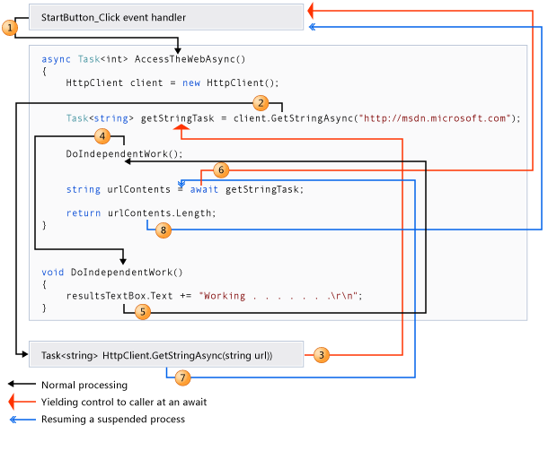

# Software and Programming Language Theory
## Mechanized semantics
### CompCert verified C compiler

<style>
.twocolumn {
  -moz-column-count: 2;
  -webkit-column-count: 2;
}
.small { font-size: small !important; }
.smaller { font-size: 0.8em !important; }
.large { font-size: 1.5em !important; }
.huge { font-size: 2em !important; }
.inference table {
    display: inline-block;
    padding: 1em;
}

.inference table th {
    font-weight: normal;
    border-bottom: 2px solid black;
}
.ib {
    display: inline-block;
}

</style>

Course page: https://maxxk.github.io/programming-languages/
Contact author: maxim.krivchikov@gmail.com


# Mechanized Semantics for the Clight Subset of the C Language

Big-step operational semantics for a subset of the C programming language. Implemented in Coq for CompCert certifying C compiler.

Links:
1. Official site: http://compcert.inria.fr/
2. Source code repository: https://github.com/AbsInt/CompCert (non-free software, see license: https://github.com/AbsInt/CompCert/blob/master/LICENSE)
3. Complete commented (literate) Coq source code: http://compcert.inria.fr/doc/index.html
4. Full source code for the article: http://compcert.inria.fr/doc/html/Clight.html

# Bibliography
1. Jourdan J.-H., Leroy X., Pottier F. Validating LR(1) Parsers // Proceedings of the 21st European Symposium on Programming. 2012. Vol. 7211. P. 397–416.
2. Blazy R., Dargaye Z., Leroy X. Formal Verification of a C Compiler Front-End // FM 2006: Formal Methods. Springer Berlin Heidelberg, 2006. P. 460–475.
3. Leroy X. Formal Verification of a Realistic Compiler // Communications of the ACM. 2009. Vol. 52, № 7. P. 107–115.
4. Boldo S. et al. Verified Compilation of Floating-Point Computations // Journal of Automated Reasoning. 2015. Vol. 54, № 2. P. 135–163.
5. Blazy S., Leroy X. Mechanized Semantics for the Clight Subset of the C Language // Journal of Automated Reasoning. 2009. Vol. 43, № 3. P. 263–288.
6. Leroy X. Formal Certification of a Compiler Back-end or: Programming a Compiler with a Proof Assistant // Conference Record of the 33rd ACM SIGPLAN-SIGACT Symposium on Principles of Programming Languages. New York, NY, USA: ACM, 2006. P. 42–54.
7. Leroy X., Blazy S. Formal Verification of a C-like Memory Model and Its Uses for Verifying Program Transformations // J Autom Reasoning. 2008. Vol. 41, № 1. P. 1–31.


# Clight language
— intermediate representation of C programs (source code in C is desugared into Clight).
- no concrete syntax (but for the sake of readability we sometimes will use C-like syntax)
- no string literals (replaced with pointers to static data section)
- all expressions are pure: assignment is a statement, increment/decrement operators are disabled etc. (behavior of some constructions, unspecified by the specification, is specified at the C → Clight translation stage, e.g. order of evaluation of function arguments)
- all expressions are annotated with types
- temporary variables are introduced
- function call is a statement with result assigned to temporary variable
- `for`, `while` and `do ... while` loops are desugared into a single construction `loop <first> <next>`

# Clight abstract syntax
## Expressions
```
Inductive expr : Type :=
  (* integer literal, e.g. `1234` \*)
  | Econst_int : int → type → expr
  (* binary operation, e.g. `a+b` \*)
  | Ebinop : binary_operation → expr → expr → type → expr
  (* type cast, e.g. `(float)x` \*)
  | Ecast : expr → type → expr
  | …
```

# Clight abstract syntax
## Statements
```
Inductive statement : Type :=
  (* do nothing \*)
  | Sskip : statement
  (* assignment `lvalue = rvalue`, lvalue may contain e.g. pointer arithmetics \*)
  | Sassign : expr → expr → statement
  (* desugared loop \*)
  | Sloop : statement → statement → statement
  | Sbreak : statement
  | Scontinue : statement
  | …
```

# Clight loop desugaring
```
Definition Swhile (e: expr) (s: statement) :=
  Sloop (Ssequence (Sifthenelse e Sskip Sbreak) s) Sskip.

Definition Sdowhile (s: statement) (e: expr) :=
  Sloop s (Sifthenelse e Sskip Sbreak).

Definition Sfor (s1: statement) (e2: expr) (s3: statement) (s4: statement) :=
  Ssequence s1 (Sloop (Ssequence (Sifthenelse e2 Sskip Sbreak) s3) s4).
```

# Clight static semantics
## Global environment
G maps names of functions and global variables to memory block references, and function pointers to their definitions.

## Local and temporary environments
The local environment E maps local variables to memory block references with types.
The temporary environemnt maps local temporaries to values.

# Clight operational semantics overview
Big-step operational semantcs. 10 evaluation relations are defined:
1. G, E ⊦ a, M ⇐ L — evaluation of expressions in l-value position, i.e. targets of assignment
2. G, E ⊦ a, M ⇒ v — evaluation of expressions in r-value position
3. G, E ⊦ [a], M ⇒ [v] — evaluation of lists of expression, e.g. function call arguments
4. G, E ⊦ s, M ⇒ out, M' — evaluation of statements, terminating case, M and M' are memory states
5. G, E ⊦ sw, M ⇒ out, M' — execution of the `switch` cases
6. G ⊦ Fd([v]), M ⇒ v, M' — evaluation of function invocation, terminating case
7. G, E ⊦ s, M ⇒ ∞ — evaluation of statements, diverging case
8, 9. — diverging evaluation of `switch` cases and function invocation

10. P ⇒ B — execution of the whole program


# Indexed inductive types
Simple inductive types — represented by a set of constructors, all values have same type (see expressions and statements above).
Indexed inductive types — represented by a set of constructors and some index type. Each instance of indexed inductive type is a separate type.
Example (from [previous semester](http://maxxk.github.io/formal-models-2015/pdf/08-Inductive.pdf)):
Even : ℕ → Type :=
| even_zero : Even 0
| even_plus_2 : forall (k : ℕ), Even(k) → Even(k+2)

*Even 0,* *Even 2* and *Even 4* are of different types (but *Even 2* and *Even 4* are constructed by call of the same constructor *even_plus_2*).

# Evaluation relations in dependently-typed specification language
Evaluation relations are defined as an indexed inductive type. It is common way of definition for possibly-undecidable relations.

Inductive eval_expr (G : global) (L : local) : expr → val → Type (* expr ⇒ val *)

Two indices:
- *expr* — left hand side of relation
- *val* — right hand side of relation

Individual judgements are represented as the constructors for the indexed inductive type.
Axiom:
| eval_Econst_int : forall (i : int, ty : Ctype), eval_expr (Econst_int i ty) (Vint i)
Same judgement in different notation:
G, E ⊦ Econst_int i ty ⇒ Vint i   [eval_Econst_int]

# Evaluation relations {.inference}
Premises (antecedents) are represented as a constructor arguments:

Rule:
```
| eval_Ebinop : forall op a1 a2 ty v1 v2 v,
    eval_expr a1 v1 →
    eval_expr a2 v2 →
    sem_binary_op G op v1 (typeof a1) v2 (typeof a2) m = Some v →
    eval_expr (Ebinop op a1 a2 ty) v
```

Different notation:


  a1 ⇒ v1; a2 ⇒ v2; a1 `op` a2 $⇒_{\text{binop}}$ v
 ---------------------------------------------------
  [ty] a1 `op` a2 ⇒ v

`sem_binary_op` (binop) is a decidable relation, hence we may represent it as a function.

# Expression evaluation and static semantics
We have environments G and E as a parameters, so we can use them in premises of definition.
`expr` — relation left hand side;
`block, int` — right hand side (memory block and offset)
```
Inductive eval_lvalue (E : local) (G : global): expr → block → int → Prop :=
| eval_Evar_local : forall id  l  ty,
    E ! id = Some(l, ty) →
    eval_lvalue (Evar id ty) l Int.zero
| eval_Evar_global : forall id l ty,
    E ! id = None →
    Genv.find_symbol G id = Some l →
    eval_lvalue (Evar id ty) l Int.zero
| …
```
Note that both `eval_Evar_local` and `eval_Evar_global` have the same left hand side but different premises.

# Statement evaluation
## How can we represent the evaluation of sequence of imperative language statements in pure functional programming language?

# Continuations
Continuation is a representation of execution state of a program (for example, the call stack) at a certain point of time.
Continuation may be understood as dynamic `goto` instruction. By using continuations we may jump between different places of a program preserving the context of each.

# Continuations in practice
C# `async`/`await` asynchronous execution keywords.

<div class=small>Image source: https://msdn.microsoft.com/en-us/library/hh191443.aspx</div>

# Callback hell 
Missing counter-example of asynchronous computations in language without continuations
```javascript
function copyFile(onSuccess, onFailure) {
  var fs = require('fs');
  fs.readFile('file1.txt', { encoding: 'utf-8' }, function (error, data1) {
    if (error) {
      onFailure(error.code);
    } else {
      fs.writeFile('file2.txt', data, { encoding: 'utf-8' }, function (error) {
        if (error) {
          onFailure(error.code);
        } else {
          onSuccess();
        }
      });
    }   
  });
} 
```


# Continuations for Clight semantics
```
Inductive cont: Type :=
  | Kstop: cont
  (* Kseq s2 k = after s1 in s1;s2 *)
  | Kseq: statement -> cont -> cont
  (* Kloop1 s1 s2 k = after s1 in Sloop s1 s2 *)
  | Kloop1: statement -> statement -> cont -> cont
  (* Kloop1 s1 s2 k = after s2 in Sloop s1 s2 *)
  | Kloop2: statement -> statement -> cont -> cont
  (* catches break statements arising out of switch *)
  | Kswitch: cont -> cont
  | Kcall: option ident -> (* where to store result *)
           function -> (* calling function *)
           env -> (* local env of calling function *)
           temp_env -> (* temporary env of calling function *)
           cont -> cont.
```
Note that `Kcall` continuation constructor contains the definition and environments of calling function to be restored.

# State
Statements may modify memory state
```
Inductive state: Type :=
  | State
      (f: function)
      (s: statement)
      (k: cont)
      (e: env)
      (le: temp_env)
      (m: mem) : state
  | Callstate
      (fd: fundef)
      (args: list val)
      (k: cont)
      (m: mem) : state
  | Returnstate
      (res: val)
      (k: cont)
      (m: mem) : state.
```

# Sequence statement evaluation judgement
```
Inductive step: state -> trace -> state -> Prop :=

  | step_assign: forall f a1 a2 k e le m loc ofs v2 v m',
      eval_lvalue e le m a1 loc ofs ->
      eval_expr e le m a2 v2 ->
      sem_cast v2 (typeof a2) (typeof a1) = Some v ->
      assign_loc ge (typeof a1) m loc ofs v m' ->
      step (State f (Sassign a1 a2) k e le m)
        E0 (State f Sskip k e le m')
```

# Loop statement evaluation judgements
```
| step_loop: forall f s1 s2 k e le m,
    step (State f (Sloop s1 s2) k e le m)
      E0 (State f s1 (Kloop1 s1 s2 k) e le m)
| step_skip_or_continue_loop1: forall f s1 s2 k e le m x,
    x = Sskip \/ x = Scontinue ->
    step (State f x (Kloop1 s1 s2 k) e le m)
      E0 (State f s2 (Kloop2 s1 s2 k) e le m)
| step_break_loop1: forall f s1 s2 k e le m,
    step (State f Sbreak (Kloop1 s1 s2 k) e le m)
      E0 (State f Sskip k e le m)
| step_skip_loop2: forall f s1 s2 k e le m,
    step (State f Sskip (Kloop2 s1 s2 k) e le m)
      E0 (State f (Sloop s1 s2) k e le m)
| step_break_loop2: forall f s1 s2 k e le m,
    step (State f Sbreak (Kloop2 s1 s2 k) e le m)
      E0 (State f Sskip k e le m)
```

