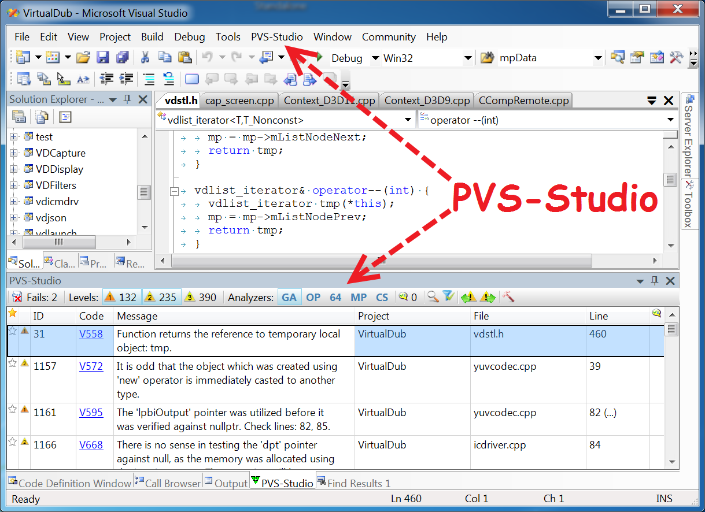
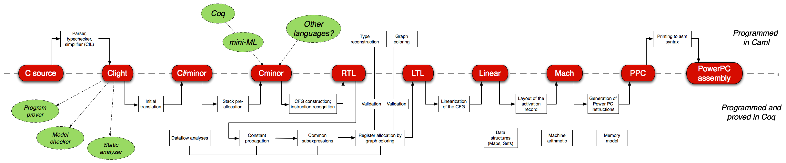
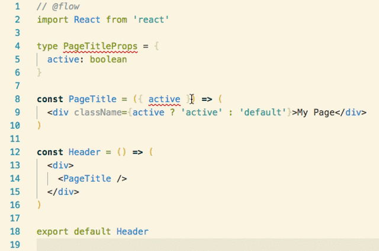

Описание семантики предметно-ориентированных языков программирования с использованием подтипов
**********************************************************************************************

М.А. Кривчиков
==============

Введение
********

Проблемная область — разработка крупных наукоёмких программных комплексов и верификация их функциональных свойств.

Свойства: 

- гетерогенность кода
- перманентное внесение изменений в код
- распределённость

Верификация и валидация
***********************

**верификация**
— процесс, целью которого является показать соответствие продукта, сервиса или системы требованиям, спецификациям и другим условиям, которые накладываются на продукт

**валидация**
— процесс, целью которого является определить адекватность продукта, сервиса или системы потребностям заказчика

Верификация выполняется путём анализа кода системы.

Существующие подходы к анализу можно разделить на экспертные, статические и динамические.

Экспертный анализ
*****************

1. Формализованный процесс (например, [Fagan inspection (1976)](https://en.wikipedia.org/wiki/Fagan_inspection))
    
    - отдельная стадия разработки
    - большое количество участников и ролей
    - несколько этапов
    - широкий набор критериев

Использовался в NASA, IBM, Motorola.

2. Неформализованный процесс рецензирования кода

    - рецензирование изменений по email (ядро ОС Linux)
    - парное программирование
    - средства рецензирования, интегрированные в процессы разработки (например, [Reviewable](https://reviewable.io))

3. Ручное тестирование по программе испытаний

Экспертный анализ
*****************

Достоинства
===========

- можно реализовать без использования технических средств
- полезен для командной разработки

Недостатки
==========

- зависит от экспертного мнения;
- не автоматизирован;
- на больших объёмах кода сложен в применении.

Динамический анализ
*******************

— анализ кода системы путём его запуска на исполнение.

(Автоматизированное) тестирование
=================================

* методы чёрного/белого/серого ящика
* юнит-тестирование, интеграционное, интерфейсное, системное, приёмочное, регрессионное тестирование, smoke-тестирование, sanity-тестирование
* функциональное или нефункциональное тестирование (производительность, безопасность, живучесть, удобство использования)

Может быть интегрировано в процессы разработки с использованием подходов "Test-Driven Development" или "Behavior-Driven Development"

(Автоматизированное) тестирование
*********************************

Достоинства
===========

- наглядность
- требуется стандартами разработки

Недостатки
==========

- большой объём кода тестов по сравнению с кодом продукта (SQLite: 80 тыс. строк кода / 90 млн. строк тестов);
- тесты необходимо поддерживать в актуальном состоянии;
- тесты в общем случае не гарантируют отсутствия дефектов/ошибок.

Динамический анализ
*******************

Инструментирование кода
=======================

- использование автоматизированных средств, контролирующих ход выполнения программы, с целью выявления дефектов.

Примеры существующих реализаций:

- fuzzing-тестирование (подход) ­— итерационный автоматизированный рандомизированный подбор входных данных для тестирования с целью покрытия всех ветвей на основе анализа процесса исполнения машинного кода для известных входных данных (пример реализации: AFL)
- Valgrind (инструментальное средство) проверяет корректность работы с памятью, примитивов синхронизации 

Статический анализ
******************

— анализ кода системы без его запуска на исполнение.

Недостоверные средства статического анализа
===========================================

Способны обнаружить некоторые типичные дефекты исходного кода. 

- предупреждения компилятора
- анализаторы для динамических языков программирования (pylint, pyflakes для Python, jslint для JavaScript)
- анализаторы для языков программирования со статической типизацией (PVS-Studio для C/C++)

Пример: PVS-Studio
******************

Формальные методы в инженерии программ
**************************************

Общий недостаток перечисленных подходов: не определены гарантии, которые предоставляются этими подходами.

Более строго — в настоящее время нет формальной модели, по отношению к которой показана достоверность этих подходов.

Формальные методы в инженерии программ — область приложения строгих математических методов к процессам спецификации, разработки и верификации программного обеспечения.

Теорема Райса (фундаментальное ограничение): нетривиальные семантические свойства программ неразрешимы.

Формальные методы
*****************

Тестирование
============

Автоматизированная генерация тестовых данных по формальной спецификации

UniTESK (ИСП РАН)

QuickCheck

.. code:: haskell

    prop_PrefixSuffix :: [Int] -> Int -> Bool
    prop_PrefixSuffix xs n = isPrefixOf prefix xs &&
                            isSuffixOf (reverse prefix) (reverse xs)
    where prefix = take n xs

    prop_Sqrt :: Double -> Bool
    prop_Sqrt x
    | x < 0            = isNaN sqrtX
    | x == 0 || x == 1 = sqrtX == x
    | x < 1            = sqrtX > x
    | x > 1            = sqrtX > 0 && sqrtX < x
    where
        sqrtX = sqrt x

Достоверные средства статического анализа
*****************************************

Достоверные (sound) методы статического анализа основаны на формальной спецификации языка программирования и формальной спецификации исследуемой программы. Такие методы не дают ложных отрицательных результатов, но дают ложные положительные.

- Frama-C, OpenSource:

.. code:: c

    int max_array(int* a, int length) {
        int m = a[0];
        /*@
        loop invariant 0<=i<=length; loop invariant
        \forall integer j; 0<=j<i ==> m >= a[j]; loop invariant
        \exists integer j; 0<=j<i && m == a[j]; loop assigns i,m;
        */
        for (int i = 1; i<length; i++) {
            if (a[i] > m) m = a[i]; }
        return m;
    }

- Polyspace, коммерческое средство от разработчиков MATLAB

Верификация моделей программ
****************************

— подход, обеспечивающий выполнение требуемых свойств путём исчерпывающей проверки всего возможного множества состояний.

На настоящее время наиболее успешно используемый на практике подход к формальной верификации программного обеспечения.

Автоматизированный подход, который:

- верифицирует модели состояний и переходов,
- обеспечивает выполнение *темпоральных* свойств (свойств, которые формулируются в понятиях «до» и «после» некоторого состояния).

Современная разновидность Software Model Checking via Counterexample Guided Abstraction Refinement.

Э.М. Кларк и др. Верификация моделей программ. Model checking. М.:МЦНМО, 2002.

Системы типов
*************

Система типов [языка программирования] — это гибко управляемый синтаксический метод доказательства отсутствия в программе определенных видов поведения при помощи классификаций выражений языка по разновидностям вычисляемых ими значений.

Б. Пирс. Типы в языках программирования. М.: Лямбда-пресс: Добросвет, 2011.

Системы типов позволяют проводить достоверный статический анализ программ для ограниченного набора свойств.

Как правило, на практике доказательство достоверности системы типов не проводится (однако это возможно в теории).

Системы типов: примеры
**********************

- в языках Java и C# гарантируется отсутствие ошибок при работе с памятью (выход за границы области памяти, ошибки при освобождении памяти). Доказательства достоверности не производятся
- в языке Rust гарантируется отсутствие ошибок при работе с памятью (детерминированное освобождение памяти), в том числе для многопоточных программ. Ведётся исследование на предмет доказательства достоверности
- система типов языка Haskell (без расширений) достоверна
- системы типов языков Agda, Idris и средства Coq достоверны и достаточно выразительны для описания формулировок теорем в рамках интуиционистской логики

Применимость формальных методов
*******************************

Существующие методы верификации не подходят для крупных наукоёмких программных комплексов, поскольку формальная спецификация поведения системы со всеми деталями быстро становится сложнее, чем реализация системы.

Пример: UniTESK-модель для спецификации POSIX: https://github.com/bitia-ru/olver/tree/master/src/model 

Пример: SeL4
************

Микроядро операционной системы (семейство микроядер L4), реализация которого верифицирована по отношению к его формальной спецификации с использованием средства Isabelle/HOL.

- 3 тыс. строк формальных спецификаций
- 10 тыс. строк кода на C (реализация)
- 100 тыс. строк формальных доказательств

(Контр)пример: CompCert
***********************

Верифицированный компилятор языка C, поддерживающий значительную часть ISO C99 (полностью поддерживает части спецификации, рекомендуемые к использованию спецификацией MISRA-C 2004). Реализован почти полностью в среде Coq.

CompCert
********

::

    -------------------------------------------------------------------------------
    Language            Files        Lines         Code     Comments       Blanks
    -------------------------------------------------------------------------------
    Assembly               61         4584         4238            0          346
    C                     220        95473        64487        17955        13031
    C Header               86        14771         7814         4422         2535
    Coq                   225       176601       145869        13375        17357
    CSS                     3          193          149           15           29
    HTML                    1          352          308            0           44
    JavaScript              1           24           23            0            1
    Makefile                9          733          515           52          166
    Markdown                2           72           72            0            0
    OCaml                 150        35080        26589         4440         4051
    Perl                    1           18           15            1            2
    Shell                   4          883          654          131           98
    Plain Text              2         1672         1672            0            0
    -------------------------------------------------------------------------------
    Total                 765       330456       252405        40391        37660
    -------------------------------------------------------------------------------

Tiny C Compiler
***************

::

    -------------------------------------------------------------------------------
    Language            Files        Lines         Code     Comments       Blanks
    -------------------------------------------------------------------------------
    Assembly                4          665          547            0          118
    Autoconf                1            9            1            4            4
    Batch                   1           28           28            0            0
    C                      34        30915        25275         2815         2825
    C Header               77        24919        20670         2430         1819
    CMake                   2          476          342           93           41
    HTML                    1         2241         2078           23          140
    Makefile                2          417          303           41           73
    Module-Definition       5         2770         2718            0           52
    Perl                    1          427          306           63           58
    Shell                   2          415          355           27           33
    Plain Text              1          158          158            0            0
    -------------------------------------------------------------------------------
    Total                 131        63440        52781         5496         5163
    -------------------------------------------------------------------------------

Спецификация языков программирования
************************************

Синтаксис
=========

Статическая семантика
=====================

Динамическая семантика
======================

- текстовая спецификация
- компилятор или интерпретатор
- операционная семантика
- денотационная семантика
- аксиоматическая семантика

Предметно-ориентированные языки
*******************************

Семантику языков программирования общего назначения сложно описать из-за их универсальности (эквивалентности машине Тьюринга). 

Для описания формальной семантики и последующей формальной верификации удобнее использовать ограниченные предметно-ориентированные языки.

Предметно-ориентированный язык программирования — язык, адекватно отражающий специфику некоторой предметной области. 

Код на таких языках, как правило, декларативен и описывает в большей степени спецификацию программы ("денотационный подход"), а не её реализацию ("операционный подход"). 

Языково-ориентированное программирование
****************************************

(M. Ward, 1994) 

1. В форме спецификации разрабатываются языки, адекватно отражающие специфику предметной области, задачи которой должен решать программный продукт. 

2. Разработка разделяется на два (в идеале — независимых) процесса: 

- описание целевого программного продукта в терминах предметно-ориентированных языков; 
- создание средств трансляции или компиляции таких языков для выполнения программы. 

Предметно-ориентированные языки
*******************************

Предметно-ориентированный язык в нашем понимании — это, прежде всего, семантика. 

Модель предметной области фиксируется в виде предметно-ориентированного языка.

Далее на основе семантики:

- доказываются свойства программы (вверх по уровню абстракции от оборудования)
- доказывается корректность реализации (вниз по уровню абстракции от оборудования)

Предметно-ориентированные языки
*******************************

Замечания
=========

Предметно-ориентированные языки можно реализовать как внешним образом (HTML+CSS, SQL, Bison, YACC, Antlr, ...), так и внутренним (макросы LISP, eDSL в Haskell, Scala, JSX, LINQ). 

Если определить предметно-ориентированный язык с позиций семантики, то к такому определению целесообразно отнести и интерфейсы библиотек программных модулей (например, BSD Sockets или части стандартной библиотеки языка C, POSIX), и протоколы (HTTP).

Для языково-ориентированного программирования представляется необходимым наличие связующего языка (glue language), который организует отдельные аспекты предметной области в программный комплекс. Современная практика разработки показывает, что в качестве такого языка используются динамические языки (Python, JavaScript, Lua).

Предлагаемый подход
*******************

Цель: собрать подход к итеративной разработке верифицируемых сложных программных систем на основе предметно-ориентированных языков.

Задача: средство описания семантики предметно-ориентированных языков, внешних библиотек и связующего языка, обеспечивающее возможность формального описания системы, совместимое при этом с частью существующих средств формальной верификации.

Промежуточные представления
***************************

Как правило, для анализа программ используется не их исходный код, а некоторое промежуточное представление с меньшим, чем у исходного кода, уровнем детализации (уникальность идентификаторов, раскрытие синтаксического сахара), однако с большим уровнем абстракции от оборудования, по сравнению с машинным кодом.

Классификация промежуточных представлений
*****************************************

1. Низкоуровневые промежуточные представления, используемые в компиляторах в машинный код (LLVM, Typed Assembly Language).
2. Виртуальные машины уровня приложений на основе байт-кода, ориентированные на императивные языки программирования (JVM/Java, CLI/C#).
3. Виртуальные машины уровня приложений на основе байт-кода, ориентированные на функциональные языки программирования (ZINC/OCaml, WAM/Prolog, BEAM/Erlang, Python).
4. __Внутренние промежуточные представления на основе графа потока исполнения, сохраняющие информацию о типах значений (CPS).__
5. Высокоуровневые, специфичные для языка программирования промежуточные представления на основе канонических форм синтаксического дерева (STG/Haskell, Cminor/CompCert/C).

Васенин В. А., Кривчиков М. А. Методы промежуточного представления программ // Программная инженерия. — 2017. — Т. 8, № 8. — С. 345–353.

Предлагается использовать промежуточное представление уровня 4 по этой классификации с достаточно выразительной для решения задачи системой типов.

Системы типов
*************

В виде формальной системы с основным отношением — суждением типизации (t : T), где t — терм ("код программы"), а T — тип ("спецификация").

Свойство системы типов: сильные (C#, Python) или слабые (C) типы

Свойство её реализации: статическая (Haskell) или динамическая (Python) проверка

λ-исчисление с зависимыми типами
********************************

Зависимые типы — свойство системы типов, которое позволяет использовать значения для описания типов. 

Например:

::

    mult : forall (n m p : nat), matrix n m -> matrix m p -> matrix n p

Реализовано в виде среды Coq, языков Agda и Idris.

Исследования проводились также автором доклада в диссертации "Формальные модели и верификация свойств программ с использованием промежуточного представления".

Недостатки статической типизации
********************************

Использовать сильную статическую типизацию на ранних стадиях разработки программного комплекса сложно: система типов сразу фиксирует спецификацию кода. 

С этим фактом связана высокая популярность в настоящее время динамических языков (Python, JavaScript), особенно в области анализа данных. 

В компиляторе GHC языка Haskell есть флаг ``-fdefer-type-errors``, который заменяет ошибки типизации исключениями во время исполнения нетипизированных веток функции.

Однако для прототипирования система типов Haskell даже с учётом этого флага может быть ограничивающим фактором. Например, следующее определение функции некорректно и не может быть использовано даже с отложенными ошибками типизации.

.. code:: haskell

    foo :: a -> b
    foo True  = False
    foo False = "Hello world!"
    foo 'x'   = 42

Постепенная типизация
*********************

Gradual typing — система типов, в которой для части кода проверки системы типов осуществляются статически на этапе компиляции, а часть кода помечается как нетипизированная и проверяется динамически на этапе исполнения.

Примеры постепенной типизации
*****************************

Flow и TypeScript (JavaScript)
==============================

.. code:: javascript

    /*::
    type BinaryTree =
    { kind: "leaf", value: number } |
    { kind: "branch", left: BinaryTree, right: BinaryTree }
    */
    function sumLeaves(tree /*: BinaryTree*/) /*: number*/ {
        if (tree.kind === "leaf") {
            return tree.value;
        } else {
            return sumLeaves(tree.left) + sumLeaves(tree.right);
        }
    }

Примеры постепенной типизации
*****************************

MyPy (Python3)
==============

.. code:: python

    def send_email(address: Union[str, List[str]],
               sender: str,
               cc: Optional[List[str]],
               bcc: Optional[List[str]],
               subject='',
               body: List[str] = None
               ) -> bool:

Системы подтипов
****************

Средства постепенной типизации используют основаны не на системе типов, а на системе подтипов.

Система типов: типы неупорядочены, каждый терм имеет только один тип (t : T), где T — нормальная форма типа по отношению редукции на типах.

Система подтипов: типы образуют частичный порядок (S ⊑ T), который можно интерпретировать как "значение типа S можно подставить в качестве значения типа T".

Постепенная типизация вводит понятие "типа-джокера" ``any``, такой, что (S ⊑ any) для любого типа S. 

Обратное отношение (any ⊑ S) возможно только с нарушением достоверности, но на практике его допускается использовать в некоторых случаях.

Подтипы для языково-ориентированного программирования
*****************************************************

1. В форме спецификации разрабатываются языки, адекватно отражающие специфику предметной области, задачи которой должен решать программный продукт. 

Спецификация представляется в виде пары типов:

- StaticSemantics (статическая семантика предметно-ориентированного языка) 
- Specification (абстрактная спецификация языка, Specification : StaticSemantics → D). 

Для этапа прототипирования допускается использование "типа-джокера", чтобы отложить уточнение несущественных аспектов на более поздний этап разработки.

Подтипы для языково-ориентированного программирования
*****************************************************

2. Разработка разделяется на два (в идеале — независимых) процесса: 

- описание целевого программного продукта в терминах предметно-ориентированных языков; 

Код на предметно-ориентированном языке — program : StaticSemantics.

Формальная верификация функциональных свойств производится с использованием гарантий, которые предоставляются абстрактной спецификацией:

Specification(program) : D, Property(Specification(program))

- создание средств трансляции или компиляции таких языков для выполнения программы. 

Динамическая семантика языка, DynamicSemantics ⊑ Specification

Образцы
*******

Промежуточное представление используется для описания типов и термов одновременно. Разработанное автором на основе существующего байт-кода представление описывает процесс сопоставления значения с образцом:

.. code::

    // Образцы
    Recognizer ::=

        /// Точное заданное значение
        Exact(Value),

        /// Произвольное значение заданного примитивного типа
        ValueLiteral(ValueType),

        /// Список
        Structural,

        /// Произвольное значение любого примитивного типа
        Literal,

        /// Любое одиночное значение, включая список
        Term,

        /// Повторение уже распознанного значения с заданным номером
        OldExpression(Variable),

Сопоставление с образцом
************************

.. code::

    /// Код функции
    Expr ::=

        /// Завершить распознавание с ошибкой
        Fail

        /// Распознать значение 
        Recognize(Recognizer) 

        /// Распознать остаток
        Close

        /// Убедиться, что значение распознано без остатка
        Check

        /// Перейти к анализу ранее распознанного фрагмента
        Range(Variable),

        /// Ветвление
        Branch(Branch),

        /// Записать в результат вызов функции
        Eval(ExprVector),

        /// Записать в результат значение-константу
        Value(Value),

        /// Записать в результат значение ранее распознанного фрагмента
        EmitValue { index: Variable, unquote_level: u8 },

        /// Записать в результат список, перейти к формированию его составных частей
        Structural(ExprVector),

        /// Записать в результат функцию
        Function{ name: Option<Symbol>, body: ExprVector },

        /// Выполнить все вызовы функций в результате и записать
        /// полученное выражение в качестве распознанного фрагмента
        Push,
        ...

Отношение распознавания
***********************

На этапе проверки типов значения отождествляются с константными образцами. Вместо отношения типизации в качестве базового используется отношение распознавания:

Pattern₁ ≤ Pattern₂, если все значения, которые распознаются образцом Pattern₁ распознаются образцом Pattern₂.

Примеры:

.. code::

    t : int    -->  Recognize OldExpression(t) ≤ Recognize ValueLiteral(int)

    t : 1 | 2  -->  Recognize OldExpression(t) ≤ Branch( (Recognize Exact 1), (Recognize Exact 2) )

    1 : 1 | 2  -->  Recognize Exact 1 ≤ Branch( (Recognize Exact 1), (Recognize Exact 2) )

Типы функций
************

Типы — это завершимые функции промежуточного представления.

Завершимость может быть относительной, в зависимости от входных данных:

.. code:: javascript

    function f(x) {
        if (x instanceof Number) return x + 1;
        while(true) {}
    }

Основное отношение — (трёхместное) отношение совместимости (подтипов).

f ⊑ₜ g, если:

1. ограничение g на входные образцы t завершимо (Terminates(g, t))
2. любой входной образец f принимается g
3. любое выходное значение f принимается g для данного входного образца

Выражения дополняются выражениями Terminates, Prove.

Теоретические результаты
************************

Завершимые функции с отношением ⊑ₜ при фиксированном t образуют предпорядок (отношение рефлексивно и транзитивно, но не антисимметрично). Если отождествить функции по антисимметричности (f ⊑ₜ g, g ⊑ₜ f ⇒ f =ₜ g), то на множестве таких классов эквивалентности отношение образует частичный порядок. 

Классы эквивалентности завершимых функций с отношением ⊑ₜ образуют полную решётку:

- наименьший элемент — Function{ Fail }
- наибольший элемент — t → Close (глобальный наибольший элемент — Function { Close })
- представитель верхней грани определяется ветвлением (f ∨ g — выражение Branch(f, g))
- представитель нижней грани определяется последовательным сопоставлением

Предположительно, система подтипов непротиворечива, планируется построить модель в терминах теории доменов.

Автоматическое доказательство не может использовать транзитивность отношения совместимости т.к. это делает проверку типов неразрешимой.

Предполагается использовать автоматизированное доказательство с ручным указанием дополнительных разбиений образцов, для этого набор выражений потребуется расширить.

Совместимость с известными моделями
***********************************

Предлагаемая система типов заведомо не менее мощна, чем λ-исчисление с простыми типами:

    Type ::= B | τ₁ → τ₂

    B = Recognize ValueLiteral(B)

    τ₁ → τ₂ = Function{ Recognize Term, Prove(τ₁, EmitValue 1), Push, Prove(τ₂) }

Открытые вопросы:

- полиморфное λ-исчисление?
- исчисление конструкций?

Типы представимы, однако соответствие и системы типов и разрешимость проверки типов требует доказательства.

Реализация
**********

Основой для промежуточного представления стал язык Рефал [1] и его промежуточное представление "Язык сборки" [2].

Основные отличия:

- язык сборки относится к третьему классу промежуточных представлений (виртуальные машины уровня приложений на основе байт-кода, ориентированные на функциональные языки программирования), а предлагаемое промежуточное представление — к четвёртому (внутренние промежуточные представления на основе графа потока исполнения, сохраняющие информацию о типах значений).
- язык сборки описан для языка "Рефал-2", в предлагаемом промежуточном представлении поддерживаются функции высшего порядка
- промежуточное представление существенно расширено для системы типов
- планируется детальное сравнение с представлением "язык рефал-графов", которое используется в суперкомпиляторе SCP-4 [3].

[1] Турчин В. Ф. «Метаалгоритмический язык». Кибернетика, вып. 4 (1968 г.): 45–54

[2] Романенко С.А. Машинно-независимый компилятор с языка рекурсивных функций: Диссертация на соискание учёной степени кандидата физико-математических. Москва: ИПМ АН СССР, 1978

[3] А.П. Немытых. Суперкомпилятор SCP4. Общая структура. М.: Издательство ЛКИ, 2007. 

Метавычисления и суперкомпиляция
********************************

Метавычисления — это раздел теории и практики программирования, связанный с разработкой и использованием метапрограмм — конструктивных метасистем над программами.

Суперкомпиляция — техника преобразования программ [в первую очередь — оптимизации], основанная на построении полной и самодостаточной модели программы. [2]

Две основные стадии суперкомпиляции:

1. *Прогонка* программы на параметризованных входных данных (частичная специализация). Выполняется построение множетсва конфигураций машины.
2. *Свёртка* результата прогонки для получения остаточной программы (выделение рекурсии).

[1] С.М. Абрамов. Основы метавычислений. Курс НОУ ИНТУИТ. http://www.intuit.ru/studies/courses/1067/221/info

[2] И.Г. Ключников. Суперкомпиляция: идеи и методы. Практика функционального программирования, № 7, 2011.

Суперкомпиляция для решения задач верификации
*********************************************

Известны публикации, в которых суперкомпиляция используется для верификации, однако используется она как средство верификации моделей программ, на относительно невысоком уровне абстракции от оборудования.

[1] Klimov A.V. (2010) A Java Supercompiler and Its Application to Verification of Cache-Coherence Protocols. In: Pnueli A., Virbitskaite I., Voronkov A. (eds) Perspectives of Systems Informatics. PSI 2009. Lecture Notes in Computer Science, vol 5947. Springer, Berlin, Heidelberg

[2] A. Lisitsa and A. Nemytykh, "Towards verification via supercompilation," 29th Annual International Computer Software and Applications Conference (COMPSAC'05), Edinburgh, 2005, pp. 9-10 Vol. 1.

[3] Lisitsa, A., & Nemytykh, A. P. (2008). Reachability analysis in verification via supercompilation. International Journal of Foundations of Computer Science, 19(04), 953-969.

[4] Lisitsa, A. P., & Nemytykh, A. P. (2007). Verification as a parameterized testing (experiments with the SCP4 supercompiler). Programming and Computer Software, 33(1), 14-23.

В монографии [5] отмечается связь между суперкомпиляцией и типизацией, однако в дальнейшем речь в ней идёт исключительно о суперкомпиляции для оптимизации.

[5] А.П. Немытых. Суперкомпилятор SCP4. Общая структура. М.: Издательство ЛКИ, 2007. 

Изменения синтаксиса
********************

Несмотря на тот факт, что для проверки типов используется промежуточное представление, для разработки средств проверки типов необходимо использовать язык с конкретным синтаксисом. Автором доклада был модифицирован синтаксис языка с целью его приведения к более привычному для современного состояния виду.

Традиционный синтаксис:

.. code::

    DqString (e.prefix) e.str = e.str => {
        '\\' s.escape e.rest =
            s.result : <StringEscape s.escape>
            = <DqString (e.prefix s.result) e.rest>;
        '\"' e.rest = (String e.prefix) <Lexer e.rest>;
        s.next e.rest = <DqString (e.prefix s.next) e.rest>  
    };
    
Новый синтаксис:

.. code::

    // Строка в двойных кавычках. 
    // На вход подаётся строка, начиная с символа, следующего за открывающей кавычкой.
    fn DqString (e.prefix) e.str => match e.str with {
        '\\' s.escape e.rest, 
            let s.result = <StringEscape s.escape>
            => <DqString (e.prefix s.result) e.rest>;
        '\"' e.rest => (String e.prefix) <Lexer e.rest>;
        s.next e.rest => <DqString (e.prefix s.next) e.rest>  
    };

Интерпретатор промежуточного представления
******************************************

Автором доклада реализован интерпретатор промежуточного представления и разработан транслятор с языка в промежуточное представление.

Интерпретатор реализован на языке Rust (объём порядка 5 тыс. строк кода).

Транслятор был разработан на языке Рефал (в реализации, которую удалось найти в работоспособном состоянии) и с помощью метода раскрутки (bootstrapping) переведён в режим самоподдержки (self-hosting), по следующей схеме:

1. Транслятор T скомпилирован компилятором Рефал в исполнимый код E.

...

Интерпретатор промежуточного представления
******************************************

2. Итеративная доработка интерпретатора:

    a. Получено промежуточное представление фрагмента транслятора (E(T') = I').
    b. Промежуточное представление подаётся на вход интерпретатору (Interpreter I').
    c. По полученным ошибкам производится доработка интерпретатора или транслятора.
    d. Итерация завершается после того как достигается самоподдержка:

        E(T) = I Interpreter(I, T) = I₁, Interpreter(I₁, T) = I₂, Interpreter(I₂, T) = I₃
        
        I₂ ≡ I₃
    
    По завершению итеративной доработки использовавшийся изначально компилятор Рефал становится не нужен.

...

Интерпретатор промежуточного представления
******************************************

3. Итеративная модификация синтаксиса:

    a. Добавляется поддержка переходного синтаксиса. 
    b. Код транслятора T переводится на переходный синтаксис. 
    c. Удаляется поддержка старого синтаксиса, добавляется поддержка нового синтаксиса.
    d. Код транслятора T переводится на новый синтаксис.

    На каждом этапе проверяется, что состояние самоподдержки сохранено.
    

Дальнейшая работа
*****************

Совместимость с существующими средствами
========================================

Если предлагаемая автором система типов не менее мощна, чем λ-исчисление с зависимыми типами, относительно просто можно разработать транслятор с языков Coq, Agda, Idris в используемую модель.

Для внешних библиотек программных модулей, которые реализованы на языках программирования общего назначения целесообразно использовать существующие подходы по тестированию на основе формальных моделей (UniTESK).

Вариант 1. Такая спецификация уже есть и её можно транслировать в тип в терминах промежуточного представления.

Вариант 2. Спецификация разрабатывается в терминах промежуточного представления и затем транслируется в язык средства тестирования.

Спасибо за внимание!
********************

Пример: язык обхода RDF-графов
******************************

Граф представлен множеством RDF-триплетов (субъект, предикат, объект). 

Предметно-ориентированный язык предназначен для обхода графа с сопоставлением с образцом и последующей генерацией подграфа.

.. code::

    Statement ::=

        /// распознать триплет
        RecognizeTriple(Variable, TripleRecognizer),

        /// распознать значение
        RecognizeValue(Variable, ValueRecognizer),

        /// обход графа
        Traverse{
            variable: Variable,
            destination: Option<Variable>,
            triplet_name: Variable,
            kind: TripleRecognizer,
            traversal: Traversal,
            statements: Vec<Statement>
        },

        /// вывод триплета
        EmitTriple(TripleEmitter),
        
        /// обращение результата
        Not(Statement),

Образцы
*******

.. code::
    
    TripleRecognizer ::= {
        subject: ValueRecognizer,
        predicate: ValueRecognizer,
        object: ValueRecognizer
    }

    ValueRecognizer ::=
        Value(Value),
        Term(Option<Variable>),
        OldValue(Variable),
        CompareDateTime(Ordering, DateTime),
        StringContains(String),
        ...

Параметры модели
****************

Graph (граф), Value (значение).

.. code::

    fn Triplet [Value] [Value] [Value]; 

Семантика образцов на значениях
*******************************

.. code::

    fn ValueRecognizerSemantics 
        [ValueRecognizer] 
        => [lambda { 
                [Value] = [{ empty; fail }]
            }];

Семантика образцов на триплетах
*******************************

.. code::

    fn TripletRecognizerSemantics {
        t.vr1 t.vr2 t.vr3 => [ lambda { [Triplet ] } ]
    }

Семантика обходов

Производная

Пример

.. ::
Дополнения
**********
    Роганов метаинтеллект
    Чечкин радикалы
    — это всё подходы к автоматизированному созданию программ, их динамическому анализу и т.п.
    Как эти средства "понимают" что делает фрагмент кода?    
    В сегодняшнем докладе
    *********************
    Существующие результаты
    ***********************
    - plt-redex, LISP-подобные макросы
    - Роганов
    - O-Meta 
